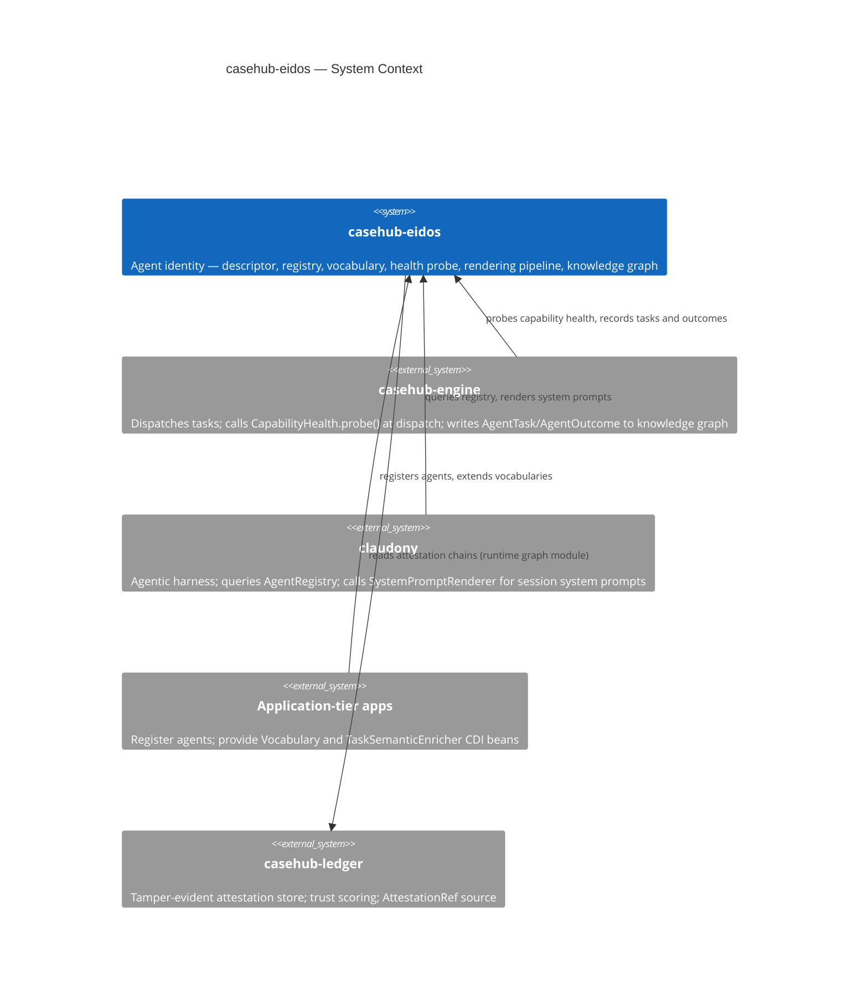
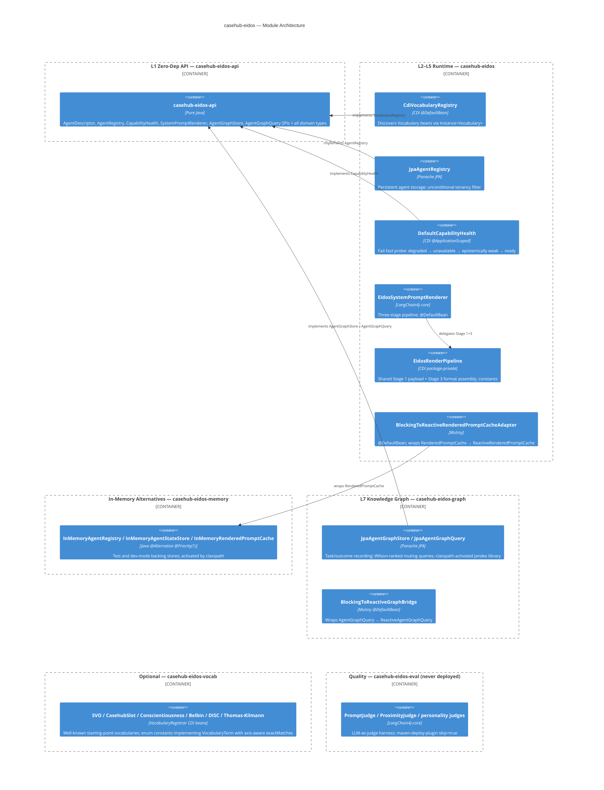
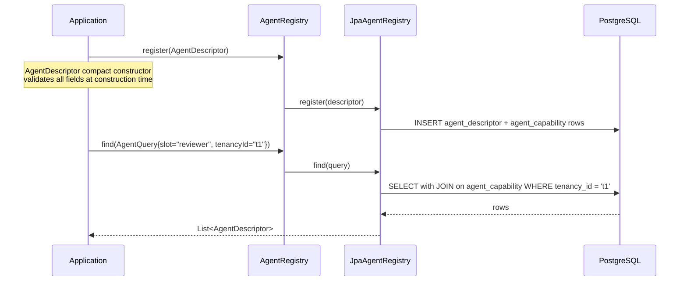
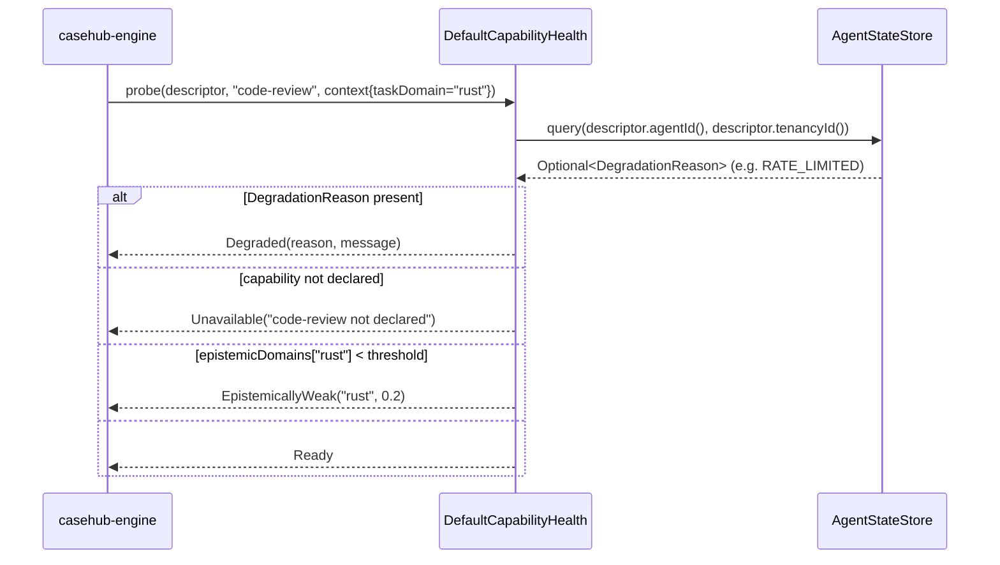
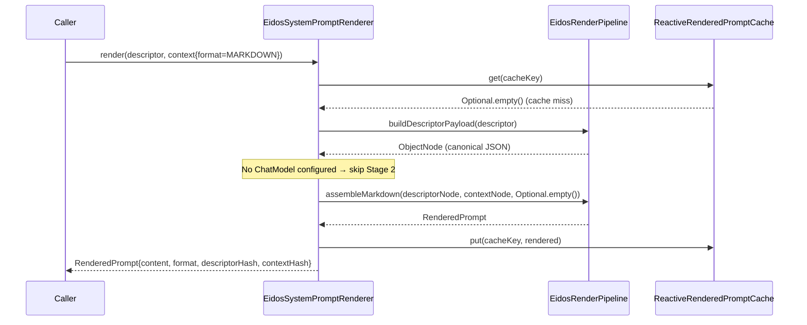
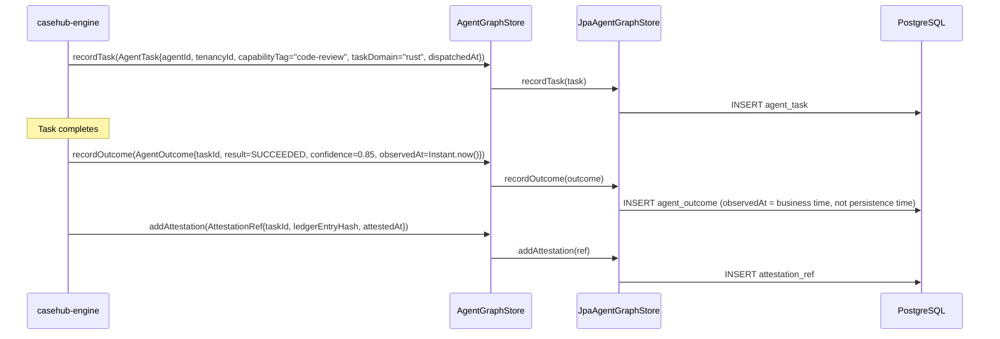
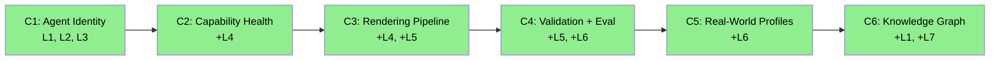

# casehub-eidos — ARC42STORIES.MD

**Spec:** Arc42Stories v0.1
**Profile:** CaseHub — Foundation tier
**Profile ref:** `../parent/docs/arc42stories-casehub-profile.md` · fallback: `https://raw.githubusercontent.com/casehubio/parent/main/docs/arc42stories-casehub-profile.md`
**Build position:** After casehub-ledger (runtime depends on ledger); casehub-eidos-api depends on nothing. Publishes before casehub-engine and claudony.
**Consumed by:** casehub-engine (optional eidos-api dep), claudony, application-tier apps that need agent identity
**Depends on:** `casehub-eidos-api` → none. `casehub-eidos` runtime → casehub-ledger.

---

## §1 Introduction and Goals

### Description

`casehub-eidos` provides agent identity management — structured agent description, a discovery registry, a vocabulary system for capability classification, system prompt generation from agent metadata, an eval harness for render quality, and a knowledge graph that records observable agent history.

Core capabilities:

- **AgentDescriptor** — four-layer structured description: identity (id, name, model, provider), slot (open-string role classification), capabilities (capability name, quality, latency, epistemic domain confidence), disposition (four open-string axes + delegation flag); optional `briefing` freeform text field for per-agent narrative context
- **AgentRegistry / ReactiveAgentRegistry** — SPI for agent registration and discovery by slot, capability, and tenancyId
- **VocabularyRegistry / CdiVocabularyRegistry** — pluggable vocabulary system; CDI `Instance<Vocabulary>` discovery with cross-vocabulary equivalence traversal
- **CapabilityHealth / ReactiveCapabilityHealth** — two-layer probe: declared (descriptor) vs. operable now (runtime degradation state); `AgentStateStore` SPI records degradation with TTL
- **SystemPromptRenderer / ReactiveSystemPromptRenderer** — three-stage render pipeline (canonical JSON payload → optional LLM semantic enrichment → format-specific assembly) into `RenderedPrompt`; `RenderedPromptCache` / `ReactiveRenderedPromptCache` SPI for cache coherence; capability rendering is format-discriminated: PROSE/MARKDOWN surface names + `inputTypes`/`outputTypes` only; numeric routing signals (`qualityHint`, `latencyHintP50Ms`, `costHint`, `epistemicDomains`) appear in A2A_CARD only — protocol PP-20260611-228599; `RenderedPrompt.enriched` flag set when Stage 2 enrichment ran
- **Eval framework** (`casehub-eidos-eval`) — LLM-as-judge quality harness; `PromptJudge` (4 dimensions), `ProximityJudge` (prose fidelity), three-stage personality preservation attribution (VocabularyExpressivenessJudge → TraitExpressionJudge → PairContrastJudge)
- **Knowledge graph** (`casehub-eidos-graph`) — `AgentGraphStore` SPI records tasks and outcomes; `AgentGraphQuery` ranks agents by Wilson lower-bound confidence; `AttestationRef` chains outcomes to casehub-ledger hashes; `TaskSemanticEnricher` SPI (pull interface for domain-specific axis correlation)

Module structure:

| Module | artifactId | Purpose |
|--------|------------|---------|
| `api/` | `casehub-eidos-api` | All domain types and SPIs — zero casehubio deps |
| `runtime/` | `casehub-eidos` | JPA registry, CDI vocabulary, health probes, rendering pipeline |
| `persistence-memory/` | `casehub-eidos-memory` | `@Alternative @Priority(1)` in-memory impls (registry, state store, cache) |
| `deployment/` | `casehub-eidos-deployment` | `@BuildStep` Quarkus processor |
| `vocab/` | `casehub-eidos-vocab` | Optional well-known vocabularies: SVO, CasehubSlot, Conscientiousness |
| `eval/` | `casehub-eidos-eval` | LLM-as-judge harness — never deployed; excluded from CI by default |
| `graph/` | `casehub-eidos-graph` | JPA knowledge graph — activates by classpath presence |
| `examples/agent-scenarios/` | — | `@QuarkusTest` scenario coverage |

### Stakeholders

| Stakeholder | Interest |
|---|---|
| casehub-engine | Probes `CapabilityHealth` at dispatch time; writes `AgentTask`/`AgentOutcome` to knowledge graph |
| claudony | Queries `AgentRegistry`; calls `SystemPromptRenderer` to build session system prompts |
| Application-tier apps | Register agents; provide `Vocabulary` and `TaskSemanticEnricher` CDI beans |
| Platform team | Maintain correctness, backward compatibility, and SPI stability |
| LLM sessions (Claude) | Navigate architecture and implement extensions confidently |

### Quality Goals

| Goal | Scenario |
|---|---|
| Zero-dep API | `casehub-eidos-api` has no casehubio dependencies — any consumer references agent identity types without pulling the eidos stack |
| No invalid record can be constructed | All string fields validated at compact constructor time; null and adversarial strings rejected before the record exists anywhere in the system |
| LLM-optional operation | Structural rendering and all registry/health operations function without any LLM configured |
| Tenancy always enforced | Every registry and graph query requires `tenancyId`; unconditional filtering enforced at the SPI level |
| Evidence-grounded ranking | Wilson lower-bound confidence scores penalise small samples — agent routing prefers established track records over high-but-narrow outcome counts |

---

## §2 Constraints

### Platform

Java 21 (on Java 26 JVM), Quarkus 3.32.2. Published to GitHub Packages as `io.casehub:casehub-eidos:0.2-SNAPSHOT`.

```bash
JAVA_HOME=$(/usr/libexec/java_home -v 26) mvn clean install
```

### Dependencies

Resolved from GitHub Packages: `https://maven.pkg.github.com/casehubio/*`. CI authentication via `GITHUB_TOKEN`.

| External dependency | Usage |
|---|---|
| `dev.langchain4j:langchain4j-core` (1.14.1) | `ChatModel` interface for optional semantic enrichment pass; interfaces only, no I/O |
| `casehub-ledger-api` | `AttestationRef` linkage in knowledge graph read path |
| `casehub-ledger` (runtime) | Full ledger access for backfill (stub — deferred to engine integration) |

---

## §3 Context and Scope



**Boundary rules:** eidos owns agent identity, discovery, vocabulary classification, prompt generation, and observable outcome history. Domain logic, business workflows, and task routing belong in application-tier repos (devtown, aml, clinical, life) and casehub-engine. Semantic meaning of task domains and disposition axis correlation belong in `TaskSemanticEnricher` implementations in consuming applications — eidos stores and queries them without interpretation.

See `../parent/docs/PLATFORM.md` Capability Ownership table and `../parent/docs/repos/casehub-eidos.md` for the authoritative boundary and consumer map.

---

## §4 Solution Strategy

### Core architectural patterns

| Pattern | Where applied |
|---|---|
| SPI-first design | All capabilities defined as pure-Java interfaces in `casehub-eidos-api`; implementations in separate modules |
| `@DefaultBean` CDI priority ladder | Tier 0: `@DefaultBean` no-op or blocking default. Tier 1: `@Alternative @Priority(1)` in-memory (casehub-eidos-memory). Tier 2: JPA (runtime). Consumers displace with their own `@Alternative @Priority(2+)` |
| Reactive build gating | Reactive implementations behind `@IfBuildProperty(name="casehub.eidos.reactive.enabled", stringValue="true")` — absent unless opted in |
| Jandex library pattern | `casehub-eidos-graph` is a library module — no `quarkus:build` goal, activates by classpath presence |
| Compact constructor validation | All string fields in domain records validated at construction time; no invalid record can exist anywhere in the system |
| Three-stage rendering | Payload builder (canonical Jackson ObjectNode) → optional LLM semantic enrichment → format-specific deterministic assembly |
| Wilson lower-bound ranking | `AgentGraphQuery.topAgentsByOutcome()` ranks by Wilson 95% lower bound — penalises small sample counts relative to raw quality |

### Foundation tier layer taxonomy

| Layer | What it represents | Chapters |
|---|---|---|
| L1 Zero-Dep API | All domain types and SPIs; zero casehubio deps; pure Java records and interfaces | C1–C6 |
| L2 CDI Discovery | `CdiVocabularyRegistry` — `Instance<Vocabulary>` discovery; in-memory registry alternatives | C1 |
| L3 JPA Registry | `JpaAgentRegistry`, Flyway schema (`agent_descriptor`, `agent_capability`); reactive build-gated variant | C1, C3 |
| L4 Capability Health | `DefaultCapabilityHealth`; `AgentStateStore` degradation tracking; fail-fast probe order | C2, C3 |
| L5 Rendering Pipeline | Three-stage pipeline; `EidosRenderPipeline` shared stage 1+3; blocking + reactive renderers; `ReactiveRenderedPromptCache` canonical SPI | C3, C4 |
| L6 Eval Framework | `PromptJudge` (4 dimensions); `ProximityJudge`; personality preservation (3-stage attribution); real-world profile library | C4, C5 |
| L7 Knowledge Graph | `AgentGraphStore` / `AgentGraphQuery` SPIs; JPA graph (`casehub-eidos-graph`); Wilson ranking; `TaskSemanticEnricher` pull interface | C6 |

### Chapter sequencing rationale

- C1 before C2: `DefaultCapabilityHealth` takes `AgentDescriptor` directly — C1 must define the type
- C2 before C3: `AgentStateStore` (C3) adds `Degraded` to the probe status enum already established in C2
- C3 before C4: C4's `ReactiveRenderedPromptCache` extends C3's cache SPI; C4's injection-surface validation applies to types introduced across C1–C3
- C4 before C5: C5's personality judges consume C4's `EidosRenderPipeline` for structural rendering; `ProfiledEvalCase` requires the sealed `EvalCase` interface from C4
- C5 before C6 (soft): C6's knowledge graph closes the loop that C5 personality preservation opened — empirical vs. declared disposition comparison. Not a hard runtime dependency.
- C2 and C3 share L4: `CapabilityHealth` probe interface arrives in C2; `AgentStateStore` + `Degraded` status arrives in C3

---

## §5 Building Block View



### Module table

| Module | Artifact | Role | Deps |
|---|---|---|---|
| `api/` | `casehub-eidos-api` | Pure Java SPIs and domain types | none |
| `runtime/` | `casehub-eidos` | All default implementations | `casehub-eidos-api`, langchain4j-core, casehub-ledger-api |
| `persistence-memory/` | `casehub-eidos-memory` | `@Alternative @Priority(1)` in-memory impls | `casehub-eidos-api` |
| `deployment/` | `casehub-eidos-deployment` | Quarkus `@BuildStep` processor (`EidosProcessor`) | Quarkus build SPI |
| `vocab/` | `casehub-eidos-vocab` | Optional SVO, CasehubSlot, Conscientiousness CDI beans | `casehub-eidos-api` |
| `eval/` | `casehub-eidos-eval` | LLM-as-judge harness; skip deploy | `casehub-eidos`, langchain4j-core |
| `graph/` | `casehub-eidos-graph` | JPA knowledge graph — Jandex library | `casehub-eidos`, casehub-ledger-api |
| `examples/agent-scenarios/` | — | `@QuarkusTest` scenario coverage | `casehub-eidos`, `casehub-eidos-memory`, `casehub-eidos-vocab` |

---

## §6 Runtime View

### Scenario 1 — Agent registration and discovery



Tenancy filter is unconditional — `AgentQuery` compact constructor requires non-null `tenancyId`; the JPA query always includes `WHERE tenancy_id = ?` without a conditional branch.

### Scenario 2 — CapabilityHealth probe at dispatch time



Probe order is fail-fast: degradation state first (known-bad agents are not worth checking further), then capability declaration, then epistemic confidence.

### Scenario 3 — System prompt rendering (structural path)



Cache key: `descriptorHash + ":" + contextHash + ":" + format + ":" + TEMPLATE_HASH`. `TEMPLATE_HASH` is computed from `PROMPT_TEMPLATE` at class load — changing the template invalidates all cached entries automatically without manual version bumps.

### Scenario 4 — Knowledge graph outcome recording



`observedAt` is the instant the agent produced the result as known to the caller — `Instant.now()` at the call site for live recording. Future backfill from `AttestationRef.attestedAt()` is a stub pending casehub-ledger engine integration.

---

## §7 Deployment View

Published to GitHub Packages as `io.casehub:casehub-eidos:0.2-SNAPSHOT`.

| Concern | Detail |
|---|---|
| Build | `JAVA_HOME=$(/usr/libexec/java_home -v 26) mvn clean install` |
| CI | GitHub Actions; dispatches downstream engine workflow on publish |
| Registry | `https://maven.pkg.github.com/casehubio/*` — auth via `GITHUB_TOKEN` |
| GraalVM native | Not targeted — foundation module; library distribution only |
| DB | PostgreSQL (production); H2 `MODE=PostgreSQL` (`@QuarkusTest`); no deployed instances — all schema changes rewrite base migration files |
| Flyway | `V1__initial_schema.sql` (agent_descriptor BIGSERIAL surrogate PK, agent_capability); `V2__agent_degradation_state.sql`; `V3__agent_graph.sql` (agent_task, agent_outcome, attestation_ref) |

---

## §8 Crosscutting Concepts

### Governing protocols

| Concern | Protocol / Reference |
|---|---|
| Module structure | `docs/protocols/universal/module-tier-structure.md` |
| Flyway migrations | `docs/protocols/casehub/flyway-version-range-allocation.md` |
| CDI displacement (`@DefaultBean`) | `docs/protocols/casehub/alternative-extension-patterns.md` |
| Reactive build gating | `docs/protocols/casehub/reactive-service-build-gating.md` |
| String validation surface | `docs/protocols/casehub/PP-20260530-2d6dbd` (character set rules) |
| RenderFormat naming | `docs/protocols/casehub/PP-20260531-60dc12` (structure-named over provider-named) |
| A2A enrichment isolation | `docs/protocols/casehub/PP-20260529-368527` (format-specific enrichment schema) |
| Capability ownership | `../parent/docs/PLATFORM.md` Capability Ownership table |
| Architectural patterns | `../parent/docs/ARCHITECTURE.md` |

### Anti-patterns

**Anti-pattern 1 — Passing `capabilityTag` as `ProbeContext.taskDomain`**

**Symptom:** `EpistemicallyWeak` never fires even when an agent has low confidence for the task's subject domain.
**Cause:** `ProbeContext.taskDomain` is the subject domain of the task within the capability (e.g. `"rust"`, `"contracts"`). `capabilityTag` is the capability being checked (e.g. `"code-review"`). Passing `"code-review"` as `taskDomain` causes `epistemicDomains.get("code-review")` — the key is never in the map, so the probe returns `Ready` unconditionally.
**Fix:** Pass the task's subject domain as `ProbeContext.taskDomain`, not the capability tag. If the subject domain is not yet known at dispatch time, pass `null` — the probe skips epistemic filtering when `taskDomain` is null.

---

**Anti-pattern 2 — `emitOn` instead of `runSubscriptionOn` for blocking work in reactive pipelines**

**Symptom:** Blocking call (JPA, LLM, cache) runs on the Vert.x event loop instead of the worker pool; intermittent hangs or `BlockingOperationNotAllowedException` under load.
**Cause:** For `Uni.createFrom().item(supplier)`, the supplier executes during subscription. `emitOn(workerPool)` only dispatches the *downstream signal* — it has no effect on where the supplier runs. `runSubscriptionOn(workerPool)` moves the subscription request itself onto the worker pool, which is where the supplier evaluates.
**Fix:** Use `.runSubscriptionOn(Infrastructure.getDefaultWorkerPool())` on any `Uni.createFrom().item(blockingSupplier)`. Use `emitOn` only to move downstream processing *after* a non-blocking step.

---

**Anti-pattern 3 — Adding an explicit constructor to a field-injected CDI bean without preserving the no-arg**

**Symptom:** Application fails at startup with a CDI wiring error; no compile-time diagnostic.
**Cause:** Adding any explicit constructor (e.g. a package-private test constructor) removes the compiler-generated no-arg. CDI (Weld) requires a no-arg constructor to instantiate `@ApplicationScoped` beans before `@Inject` field injection runs.
**Fix:** Always declare both: `public BeanClass() {}` (CDI path) and the explicit constructor (test/injection path). See `BlockingToReactiveGraphBridge` as the canonical example.

---

**Anti-pattern 4 — Trusting `confidence < 0.0 || confidence > 1.0` to reject NaN**

**Symptom:** `AgentOutcome` with `confidence = Double.NaN` passes compact constructor validation and reaches the database, where the `CHECK (confidence BETWEEN 0 AND 1)` constraint rejects it at persist time — too late for a meaningful error message at the Java layer.
**Cause:** IEEE 754 comparison with `NaN` always returns `false`. `Double.NaN < 0.0` is `false`; `Double.NaN > 1.0` is `false`. The range check silently accepts NaN.
**Fix:** Prefix `Double.isNaN(confidence) ||` to the range condition: `if (Double.isNaN(confidence) || confidence < 0.0 || confidence > 1.0)`. The `isNaN` guard must come first.

---

## §9 Journeys and Chapters

### §9.1 Journey Overview

| Journey | Description | Chapters | Status |
|---|---|---|---|
| Foundation | Deliver the complete eidos platform capability incrementally — from descriptor schema through knowledge graph | 6 | ✅ Complete |

### §9.2 Chapter Index



| # | Chapter | Journey | Layers touched | Delta summary | Status |
|---|---|---|---|---|---|
| 1 | Agent Identity | Foundation | L1, L2, L3 | High, High, High | ✅ |
| 2 | Capability Health | Foundation | +L4 | High | ✅ |
| 3 | Rendering Pipeline | Foundation | +L4 (extend), +L5 | Medium, High | ✅ |
| 4 | Validation + Eval | Foundation | +L5 (extend), +L6 | High, High | ✅ |
| 5 | Real-World Profiles | Foundation | +L6 (extend) | High | ✅ |
| 6 | Knowledge Graph | Foundation | +L1 (extend), +L7 | Medium, High | ✅ |

**Layer × Chapter matrix**

| Layer | C1 | C2 | C3 | C4 | C5 | C6 |
|---|---|---|---|---|---|---|
| L1 Zero-Dep API | High | Med | High | High | Med | Med |
| L2 CDI Discovery | High | — | Low | — | — | — |
| L3 JPA Registry | High | Low | Low | — | — | Low |
| L4 Capability Health | — | High | Med | Low | — | — |
| L5 Rendering Pipeline | — | — | High | High | Low | — |
| L6 Eval Framework | — | — | — | High | High | — |
| L7 Knowledge Graph | — | — | — | — | — | High |

**Sequencing rationale:**

- C1 before C2: `DefaultCapabilityHealth` takes `AgentDescriptor` directly — type must exist
- C2 before C3: `AgentStateStore` (C3) adds `Degraded` to the `CapabilityStatus` sealed interface established in C2
- C3 before C4: `ReactiveRenderedPromptCache` (C4) extends the cache SPI introduced in C3; C4 injection-surface validation applies to all types from C1–C3
- C4 before C5: C5 judges consume `EidosRenderPipeline` (C4); `ProfiledEvalCase` requires sealed `EvalCase` from C4
- C5 and C6 independent at runtime: C6 knowledge graph does not depend on C5 eval types — soft ordering only (C5 motivates C6 personality validation use case)

### §9.3 Chapter Entries

---

#### Chapter 1 — Agent Identity

**Journey:** Foundation | **Sequence:** 1 of 6 | **Status:** ✅
**Delivered:** 2026-05-23 | **Issues:** eidos#1, #2, #3, #10, #11, #12 | **Blog:** `blog/2026-05-23-mdp01-agent-identity-from-scratch.md`, `blog/2026-05-26-mdp01-interceptors-eat-exceptions.md`, `blog/2026-05-26-mdp02-crash-or-silence.md`

**What this delivers**
An agent with a structured four-layer identity (who, what role, what capability, how it behaves) can be registered and discovered by slot, capability tag, or tenancy scope. Vocabulary equivalence traversal lets SVO "evaluator" resolve to CasehubSlot "reviewer" bidirectionally. Tenancy isolation is unconditional — no cross-tenant data access is architecturally possible.

**Accountability gaps closed**
- No agent identity schema → `AgentDescriptor` four-layer record with compact constructor invariants
- No discovery registry → `AgentRegistry` SPI + JPA implementation with indexed `agent_capability` table
- No vocabulary system → `VocabularyRegistry` + `CdiVocabularyRegistry` with cross-vocabulary `exactMatches` traversal

**Layer Impact**
| Layer | Delta |
|---|---|
| L1 Zero-Dep API | High |
| L2 CDI Discovery | High |
| L3 JPA Registry | High |

---

#### Chapter 2 — Capability Health

**Journey:** Foundation | **Sequence:** 2 of 6 | **Status:** ✅
**Delivered:** 2026-05-23 | **Issues:** eidos#4 | **Blog:** `blog/2026-05-23-mdp02-closing-the-loop-on-dispatch.md`, `blog/2026-05-25-mdp02-wrong-side-of-null.md`

**What this delivers**
casehub-engine can probe whether an agent's declared capability is actually operable for a given task domain before dispatching. A probe returns `Ready`, `Unavailable`, `EpistemicallyWeak`, or `Degraded`. The examples module demonstrates all four status variants and cross-vocabulary discovery end-to-end.

**Accountability gaps closed**
- No runtime capability check → `DefaultCapabilityHealth` with epistemic domain matching
- No reactive health probe → `DefaultReactiveCapabilityHealth` (`@IfBuildProperty reactive.enabled=true`)
- No worked examples → `examples/agent-scenarios/` — 5 `@QuarkusTest` scenarios

**Layer Impact**
| Layer | Delta |
|---|---|
| L4 Capability Health | High |
| L3 JPA Registry | Low |

---

#### Chapter 3 — Rendering Pipeline

**Journey:** Foundation | **Sequence:** 3 of 6 | **Status:** ✅
**Delivered:** 2026-05-24 to 2026-05-30 | **Issues:** eidos#5, #6, #7, #13, #17, #19 | **Blog:** `blog/2026-05-25-mdp01-rendering-with-and-without-brain.md`, `blog/2026-05-29-mdp01-two-architectural-errors.md`, `blog/2026-05-29-mdp02-reactive-parity-a2a-enrichment.md`, `blog/2026-05-29-mdp03-hold-no-threads.md`, `blog/2026-05-30-mdp01-deadlock-in-the-adapter.md`

**What this delivers**
An `AgentDescriptor + AgentPromptContext` pair renders into a format-specific system prompt (MARKDOWN, PROSE, or A2A_CARD) through a three-stage pipeline — deterministic without an LLM, enhanced when one is configured. Rendered results are cached; cache coherence is maintained via a canonical `ReactiveRenderedPromptCache` SPI. Runtime degradation state (`AgentStateStore`) enables `CapabilityHealth` to return `Degraded` for known-rate-limited agents.

**Accountability gaps closed**
- No system prompt generation → `EidosSystemPromptRenderer` three-stage pipeline with structural fallback
- No degradation tracking → `AgentStateStore` SPI + `NoOpAgentStateStore` (@DefaultBean) + `InMemoryAgentStateStore` (@Alternative)
- No cache coherence across blocking/reactive → `ReactiveRenderedPromptCache` canonical SPI + `BlockingToReactiveRenderedPromptCacheAdapter` @DefaultBean
- No non-blocking LLM render → `DefaultReactiveSystemPromptRenderer` with `StreamingChatModel` + `CompletableFuture.orTimeout()`

**Layer Impact**
| Layer | Delta |
|---|---|
| L5 Rendering Pipeline | High |
| L4 Capability Health | Medium |
| L3 JPA Registry | Low |

---

#### Chapter 4 — Validation + Eval

**Journey:** Foundation | **Sequence:** 4 of 6 | **Status:** ✅
**Delivered:** 2026-05-30 to 2026-06-01 | **Issues:** eidos#15, #16, #19, #20, #21, #22, #24, #25 | **Blog:** `blog/2026-05-30-mdp01-deadlock-in-the-adapter.md`, `blog/2026-05-31-mdp01-format-names-matter.md`, `blog/2026-06-01-mdp01-wrong-name-right-exception.md`

**What this delivers**
All string fields in `AgentDescriptor`, `AgentCapability`, and `AgentDisposition` are validated against prompt injection at compact constructor time — no adversarial string can reach the LLM payload. `PromptJudge` provides a four-dimension (SECOND_PERSON, CONCISENESS, FACTUAL_FIDELITY, TONE) LLM-as-judge eval with per-format summaries. `RenderFormat` is structure-named (MARKDOWN, PROSE, A2A_CARD) rather than provider-named.

**Accountability gaps closed**
- Adversarial strings can reach LLM payload → compact constructor validation on all string fields across `AgentDescriptor`, `AgentCapability`, `AgentDisposition`
- No render quality measurement → `PromptJudge` with 4 rubric dimensions; `EvalReport` with per-format `Map<RenderFormat, EvalSummary>` summaries
- Provider-named `RenderFormat` forces new enum members per LLM vendor → structure-named `MARKDOWN`/`PROSE`/`A2A_CARD`
- A2A completeness check always passes (substring match finds name in JSON) → JSON-aware check: each capability object must have a non-empty `description` field

**Layer Impact**
| Layer | Delta |
|---|---|
| L5 Rendering Pipeline | High |
| L6 Eval Framework | High |
| L4 Capability Health | Low |

---

#### Chapter 5 — Real-World Profiles

**Journey:** Foundation | **Sequence:** 5 of 6 | **Status:** ✅
**Delivered:** 2026-06-02 | **Issues:** eidos#23 | **Blog:** `blog/2026-06-02-mdp01-grounding-agent-identity.md`

**What this delivers**
Eight real-world agent profiles (derived from Anthropic Prompt Library, O*NET occupational data) ground the eval harness in practitioner-authored role definitions. Semantic proximity (`ProximityJudge`) measures whether rendered prompts faithfully convey the original prose. Three-stage personality preservation attribution (VocabularyExpressivenessJudge → TraitExpressionJudge → PairContrastJudge) localises pipeline failures to vocabulary gaps, renderer flattening, or profile design gaps.

**Accountability gaps closed**
- Synthetic eval cases cannot answer "does the pipeline preserve personality?" → 8 `ProfiledEvalCase` instances with real human-authored source prose
- No failure attribution beyond pass/fail → `PersonalityPreservationReport` with `AttributionDiagnosis` per profile × axis
- `EvalCase` record cannot carry profile safely → sealed interface `EvalCase` permits `SyntheticEvalCase` and `ProfiledEvalCase`

**Layer Impact**
| Layer | Delta |
|---|---|
| L6 Eval Framework | High |
| L5 Rendering Pipeline | Low |

---

#### Chapter 6 — Knowledge Graph

**Journey:** Foundation | **Sequence:** 6 of 6 | **Status:** ✅
**Delivered:** 2026-06-02 to 2026-06-04 | **Issues:** eidos#32, #36, #37 | **Blog:** `blog/2026-06-03-mdp01-eidos-gets-a-memory.md`, `blog/2026-06-04-mdp01-timestamps-and-gaps.md`

**What this delivers**
casehub-engine can record tasks dispatched to agents (`AgentTask`) and their outcomes (`AgentOutcome` with `observedAt` business-time timestamp and `AttestationRef` ledger linkage). `AgentGraphQuery.topAgentsByOutcome()` ranks agents by Wilson lower-bound confidence — agents with 20 outcomes at 0.78 average beat agents with 5 outcomes at 0.90. The full loop closes: identity declared → capability probed → task assigned → outcome recorded → evidence attested → trust scored.

**Accountability gaps closed**
- No observable agent history → `AgentGraphStore` SPI (recordTask, recordOutcome, addAttestation) + `JpaAgentGraphStore` JPA implementation
- No evidence-grounded routing → `AgentGraphQuery.topAgentsByOutcome()` with Wilson 95% lower-bound ranking
- No audit trail → `AttestationRef` chains outcome to `casehub-ledger` hash; `attestationsFor()` query walks the chain
- `observedAt` was persistence time, not business time → `AgentOutcome.observedAt` field records caller-captured instant; entity `from()` uses `o.observedAt()` not `Instant.now()`

**Layer Impact**
| Layer | Delta |
|---|---|
| L7 Knowledge Graph | High |
| L1 Zero-Dep API | Medium |
| L3 JPA Registry | Low |

---

### §9.4 Layer Entries

---

#### Layer — L1 Zero-Dep API

**Participates in chapters:** C1, C2, C3, C4, C5, C6
**Architectural patterns:** Hexagonal (port), Immutable Value Object, Compact Constructor Invariants
**Key protocols:** `docs/protocols/universal/module-tier-structure.md`, `docs/protocols/casehub/PP-20260530-2d6dbd`
**Design refs:** `docs/specs/2026-05-23-phase2-capability-health-design.md`, `docs/specs/2026-06-02-knowledge-graph-design.md`
**Issues:** eidos#1, #4, #5, #15, #20, #22, #32, #36, #37
**Navigation:** `git log --grep="#1\|#4\|#5\|#15\|#20\|#22\|#32" --oneline api/`
**Blog:** `blog/2026-05-23-mdp01-agent-identity-from-scratch.md`, `blog/2026-05-31-mdp01-format-names-matter.md`
**Completed:** 2026-06-04

##### What it adds

**Before:** No agent identity schema — consuming repos defined ad hoc agent concepts inconsistently.
**After:** `AgentDescriptor` — a four-layer pure-Java record with validated fields, consumed by all platform modules without any framework coupling.

What this layer adds:

- **Four-layer agent identity** — `AgentDescriptor(agentId, name, slot, capabilities, disposition, tenancyId, ...)` record; compact constructor validates all string fields at construction time; no invalid descriptor can be constructed anywhere
- **`DispositionAxis` enum** — `SOCIAL_ORIENTATION`, `RULE_FOLLOWING`, `RISK_APPETITE`, `AUTONOMY`, `CONFLICT_MODE`; `jsonKey()` returns camelCase JSON key for A2A payload; `description()` returns LLM-readable axis description for judge prompts; typed axis parameter for axis-aware `equivalentValues` resolution
- **`VocabularyMetadata` annotation** — `@Retention(RUNTIME) @Target(TYPE)` on vocabulary enum classes; `uri()` required; `name()`, `version()` default to `""`; read by `VocabularyRegistry.register(Class<T>)` — absent annotation throws `IllegalArgumentException`
- **`VocabularyRegistrar` @FunctionalInterface SPI** — `@ApplicationScoped` CDI beans call `registry.register(MyVocabEnum.class)` in their single method; replaces the removed `Vocabulary` record; discovered by `CdiVocabularyRegistry` via `@Any Instance<VocabularyRegistrar>`
- **`AgentDescriptor.briefing`** — optional freeform text field for per-agent narrative context; rendered in MARKDOWN+PROSE structural fallback; `briefingHash` included in cache key; populated in eval profiles via `vocabularyGap:FULL` entries
- **`RenderedPrompt.enriched` flag** — set `true` when Stage 2 semantic enrichment ran successfully; `ProximityJudge` skips substring completeness check when `enriched = true` (prevents false negatives on rich LLM-generated content)
- **Open-String slot** — `slot` is a plain `String`, not an enum; domain apps define their own vocabulary via `Vocabulary` CDI beans; the platform never constrains slot values
- **Capability with epistemic domain confidence** — `AgentCapability(name, qualityHint, latencyHintP50Ms, epistemicDomains Map<String,Double>)` qualifies declared capability by domain (e.g. `{"java": 0.95, "rust": 0.42}`)
- **Mandatory tenancyId** — `AgentQuery` compact constructor requires non-null `tenancyId`; `findById(agentId, tenancyId)` is the only signature — single-parameter overloads do not exist
- **Sealed CapabilityStatus** — `Ready` / `Unavailable` / `Degraded(reason, msg)` / `EpistemicallyWeak(domain, confidence)` — exhaustive probe result; callers must handle all four in a switch
- **Structure-named RenderFormat** — `MARKDOWN` / `PROSE` / `A2A_CARD`; adding an LLM provider requires no new enum member; sub-labels deferred until concrete structural differences emerge
- **AgentPromptContext** — single accumulation point: `Optional<GoalContext>`, `List<Resource>`, `situationalContext`, `RenderFormat`; wither methods support incremental construction; re-renderable at any point

Not closed here: L4 (`DefaultCapabilityHealth` implementation, `AgentStateStore` recording), L5 (rendering pipeline), L7 (knowledge graph).

##### Accountability gaps closed

| Gap | What breaks without it | Closed by |
|---|---|---|
| Cross-consumer type inconsistency | Each repo defines its own agent concept — no cross-repo discovery or health check | `AgentDescriptor` record in `casehub-eidos-api` |
| Adversarial strings reach LLM payload | Null, control characters, BiDi overrides, and zero-width joiners in capability names land in enrichment prompts | `AgentDescriptorValidator` + compact constructor on all three record types |
| Tenancy cross-contamination | Single-parameter `findById(agentId)` crosses tenant boundaries | `tenancyId` required on `AgentQuery` and `findById` signature |

##### Key files

- `api/src/main/java/io/casehub/eidos/api/AgentDescriptor.java` — four-layer agent identity record; compact constructor delegates to `AgentDescriptorValidator`
- `api/src/main/java/io/casehub/eidos/api/AgentCapability.java` — capability record with `qualityHint` (Double), `epistemicDomains` (Map), and validated string fields
- `api/src/main/java/io/casehub/eidos/api/AgentDisposition.java` — four open-string disposition axes (socialOrient, ruleFollowing, riskAppetite, autonomy) + `canDelegate` boolean
- `api/src/main/java/io/casehub/eidos/api/AgentQuery.java` — criteria record; compact constructor enforces non-null `tenancyId`
- `api/src/main/java/io/casehub/eidos/api/AgentDescriptorValidator.java` — validates required fields, optional fields, list items, and map keys against character-set rules
- `api/src/main/java/io/casehub/eidos/api/AgentValidationException.java` — thrown from all three record compact constructors; replaces `AgentDescriptorValidationException` (too narrow once capability validation was added)
- `api/src/main/java/io/casehub/eidos/api/CapabilityHealth.java` — SPI with sealed `CapabilityStatus` and `ProbeContext`; `DegradationReason` is a top-level enum
- `api/src/main/java/io/casehub/eidos/api/SystemPromptRenderer.java` — SPI: `render(AgentDescriptor, AgentPromptContext) → RenderedPrompt`; `RenderedPrompt` carries `content`, `format`, `descriptorHash`, `contextHash`
- `api/src/main/java/io/casehub/eidos/api/AgentPromptContext.java` — `Optional<GoalContext>`, `List<Resource>`, `situationalContext`, `RenderFormat`; wither methods for incremental build
- `api/src/main/java/io/casehub/eidos/api/AgentGraphStore.java` — SPI: `recordTask`, `recordOutcome`, `addAttestation`
- `api/src/main/java/io/casehub/eidos/api/AgentGraphQuery.java` — SPI: `agentHistory`, `topAgentsByOutcome`, `attestationsFor`, `historyByCapability`
- `api/src/main/java/io/casehub/eidos/api/AgentOutcome.java` — compact constructor validates `observedAt` non-null; `Double.isNaN || < 0.0 || > 1.0` guard on confidence
- `api/src/main/java/io/casehub/eidos/api/DispositionAxis.java` — enum: SOCIAL_ORIENTATION, RULE_FOLLOWING, RISK_APPETITE, AUTONOMY, CONFLICT_MODE; `jsonKey()` → camelCase JSON key; `description()` → axis description for LLM judge prompts
- `api/src/main/java/io/casehub/eidos/api/VocabularyMetadata.java` — annotation: `uri` (required), `name`, `version`; read by `VocabularyRegistry.register(Class<T>)`
- `api/src/main/java/io/casehub/eidos/api/spi/VocabularyRegistrar.java` — `@FunctionalInterface` CDI SPI; `@ApplicationScoped` beans auto-register vocab enums; replaces removed `Vocabulary` record
- `api/src/main/java/io/casehub/eidos/api/ReactiveAgentRegistry.java`, `ReactiveCapabilityHealth.java`, `ReactiveAgentGraphQuery.java` — `Uni<T>` mirrors; nested non-Mutiny types reference blocking SPI to avoid Mutiny dep on shared types

##### Key wiring

**`DegradationReason` is top-level, not nested inside `CapabilityHealth`.** Both `AgentStateStore` and `CapabilityHealth` reference it. A nested enum would couple the state store to the probe SPI.

**`AgentValidationException(field, message)` thrown from compact constructors, not from registry `register()`.** Registry implementations need zero validation code. Any `AgentDescriptor` that exists is already valid.

**Character-set rules for injection surfaces:** `AgentDescriptorValidator` rejects C0/C1 control characters (0–31, 127–159), BiDi override and isolate characters (LRE, RLE, PDF, LRO, RLO, LRI, RLI, FSI, PDI), zero-width joiners, U+2028/U+2029, and U+061C (Arabic Letter Mark). Field length limits: name ≤ 200, vocabulary URIs ≤ 500, jurisdiction/dataHandlingPolicy ≤ 1000.

**`MAX_MODEL_IDENTIFIER` and `MAX_DATA_HANDLING_POLICY` are distinct constants** even though both equal 200 / 1000 respectively — naming constants after the fields they bound, not after shared numeric values, makes the intent readable without tracing references.

##### Architectural decisions

**Why open-String slot rather than a `SlotType` enum:** domain apps define their own slot vocabulary (devtown: "planner"/"reviewer"; clinical: "triage-nurse"/"attending-physician"). An enum in the platform constrains downstream domains that the platform cannot anticipate. Tradeoff: slot values are unvalidated unless the consumer also uses `VocabularyRegistry`.

**Why compact constructor, not service-boundary validation:** every registry implementation would need to call a validator and descriptors created for unit testing could carry null required fields. Compact constructor validation makes invalid construction impossible regardless of how the descriptor enters the system.

**Why `AgentValidationException` rather than `IllegalArgumentException`:** callers that catch validation errors from all three record types need a single catch clause. `IllegalArgumentException` would be caught by `IllegalArgumentException` handlers that aren't intended to handle agent validation failures.

##### Pattern introduced

Inject-ready zero-dep API — all domain types and SPIs in one module with zero casehubio dependencies; compact constructor invariants enforce validity at the point of construction, not at service boundaries.

##### Pattern anchor

`AgentDescriptor.java` (compact constructor delegates to `AgentDescriptorValidator.validate`); `AgentValidationException.java` (thrown from all three records)

##### Gotchas

**Symptom:** `AgentCapability` compact constructor throws `AgentValidationException` for `name = null` even though the test did not set a bad name.
**Cause:** Java record compact constructors run at every construction site — including test fixtures that relied on implicit null defaults before validation was added. Tests that constructed `AgentCapability(null, ...)` for structural tests were valid under the old shape.
**Fix:** Update test fixtures to supply a non-null, non-blank `name`. Tests that validated null-slot behaviour (previously exercising `InMemoryAgentRegistry` directly) must be removed — the null state is now impossible.

---

**Symptom:** Validation passes in H2 tests but fails in production PostgreSQL for the same descriptor.
**Cause:** The Java-layer validator catches character-set violations; H2 in `MODE=PostgreSQL` does not enforce the same character collation constraints as real PostgreSQL. A descriptor with a valid-looking but malformed character (e.g. BiDi) passes H2 and fails at the PostgreSQL `CHECK` constraint.
**Fix:** Trust the Java-layer validator as the canonical enforcement point. Compact constructor validation runs before any persistence — if it passes Java validation it is safe for any compliant store.

##### Pattern to replicate

1. Create a `casehub-[name]-api` Maven module with `<packaging>jar</packaging>` and zero casehubio dependencies.
2. Define domain records as immutable Java records. Add a compact constructor that calls a static `Validator.validate(...)` method.
3. In the validator, reject null required fields with `Objects.requireNonNull(field, "fieldName")`. For string fields entering external systems (LLM prompts, A2A cards), apply character-set filtering: control characters, BiDi overrides, zero-width joiners.
4. Define SPIs as interfaces in the same module. All `find*` methods take a `tenancyId` parameter — never provide single-parameter overloads.
5. Define reactive SPI mirrors (`Uni<T>`) in the same module if the platform supports reactive — use nested non-reactive types to avoid Mutiny dependency on shared type definitions.
6. Publish the module with no runtime dependencies. Consumers depend only on this module for domain types and SPI contracts.

---

#### Layer — L2 CDI Discovery

**Participates in chapters:** C1
**Architectural patterns:** Service Locator (CDI Instance<T>), @DefaultBean CDI displacement
**Key protocols:** `docs/protocols/casehub/alternative-extension-patterns.md`
**Design refs:** `docs/specs/2026-05-23-phase2-capability-health-design.md`
**Issues:** eidos#1, #3
**Navigation:** `git log --grep="#1\|#3" --oneline runtime/src/main/java/io/casehub/eidos/runtime/vocabulary/`
**Blog:** `blog/2026-05-23-mdp01-agent-identity-from-scratch.md`
**Completed:** 2026-05-23

##### What it adds

**Before:** No vocabulary resolution — `slot`, `disposition`, and `capability` fields are raw open strings with no cross-domain equivalence.
**After:** `CdiVocabularyRegistry @DefaultBean` — discovers `Instance<Vocabulary>` CDI beans at startup; `find`, `resolve`, and `equivalentValues` traverse `exactMatches` links bidirectionally.

What this layer adds:

- **Pluggable vocabulary via CDI** — domain apps provide `Vocabulary` implementations as CDI beans; `CdiVocabularyRegistry` discovers them without explicit registration calls
- **Cross-vocabulary equivalence traversal** — `equivalentValues("svo", "evaluator")` returns all equivalent terms including CasehubSlot "reviewer" via `exactMatches` declared on each `VocabularyTerm`
- **Runtime registration** — `VocabularyRegistry.register(Vocabulary)` supports programmatic registration alongside CDI discovery; both paths co-exist

Not closed here: L3 (JPA registry), L4 (capability health uses vocabulary for slot label resolution).

##### Accountability gaps closed

| Gap | What breaks without it | Closed by |
|---|---|---|
| Cross-vocabulary discovery | SVO "evaluator" and CasehubSlot "reviewer" are opaque strings — no platform-level equivalence | `CdiVocabularyRegistry.equivalentValues()` traverses `exactMatches` links |

##### Key files

- `runtime/src/main/java/io/casehub/eidos/runtime/vocabulary/CdiVocabularyRegistry.java` — `@DefaultBean @ApplicationScoped`; discovers `@Any Instance<VocabularyRegistrar>`; three internal maps: byUri/byClass/byClassOrdered; `register(Class<T>)` reads `@VocabularyMetadata` annotation; axis-aware `equivalentValues`
- `api/src/main/java/io/casehub/eidos/api/VocabularyRegistry.java` — SPI: `register(Class<T>)`, `isRegistered`, `resolve`, `allTerms`, `equivalentValues` (typed generic + string-based + axis-aware with `DispositionAxis`)
- `api/src/main/java/io/casehub/eidos/api/VocabularyTerm.java` — interface implemented by vocabulary enum constants; `exactMatch` cross-references (same vocab); `axisExactMatch` cross-references (axis-discriminated, for DISC-as-disposition)
- `api/src/main/java/io/casehub/eidos/api/VocabularyMetadata.java` — `@Retention(RUNTIME) @Target(TYPE)` annotation; `uri()` required; `name()`, `version()` default to `""`
- `api/src/main/java/io/casehub/eidos/api/spi/VocabularyRegistrar.java` — `@FunctionalInterface`; `void register(VocabularyRegistry registry)`; `@ApplicationScoped` beans call `registry.register(MyVocabEnum.class)`
- `vocab/src/main/java/io/casehub/eidos/vocab/SvoTerm.java`, `ConscientiousnessTerm.java`, `CasehubSlotTerm.java`, `BelbinTerm.java`, `DiscTerm.java`, `ThomasKilmannTerm.java` — enum constants implementing `VocabularyTerm`; each paired with a `VocabularyRegistrar` CDI bean

##### Key wiring

**`@Any Instance<VocabularyRegistrar>`** discovers all registrar beans. `CdiVocabularyRegistry` iterates at `@PostConstruct` and calls `registrar.register(this)` for each; the registrar calls `registry.register(MyVocabEnum.class)`. Do not call `.get()` lazily; the iterator is stateful.

**`register(Class<T>)` reads `@VocabularyMetadata.uri()`** — absent annotation throws `IllegalArgumentException`. The enum class IS the vocabulary; per-constant URI methods are architecturally impossible.

**`equivalentValues` axis-aware overload** — `equivalentValues(fromVocab, value, toVocabClass, DispositionAxis axis)` resolves DISC `"dominance"` to different Conscientiousness values depending on which disposition axis is being queried. Without the axis parameter, a single DISC type maps ambiguously to multiple Conscientiousness values.

**`casehub-eidos-vocab` is optional.** Consumers that do not need well-known vocabularies omit the dependency. `CdiVocabularyRegistry` functions with zero registered vocabularies.

##### Architectural decisions

**Why `VocabularyRegistrar` @FunctionalInterface rather than `Vocabulary` record CDI bean:** The enum class IS the vocabulary — all term values are compile-time constants, not runtime instances. A `Vocabulary` record required a CDI bean that existed solely to return a list of `VocabularyTerm` records mirroring the enum constants. `VocabularyRegistrar` eliminates the mirror: domain apps write `registry.register(MyVocab.class)` and the enum constants themselves are the terms. `@Any Instance<VocabularyRegistrar>` discovers all registrar beans without explicit registration. See ADR-0004.

##### Pattern introduced

Enum-based vocabulary SPI — vocabulary enum class IS the vocabulary; `@VocabularyMetadata` annotation carries URI; `VocabularyRegistrar` @FunctionalInterface registers enum classes; `CdiVocabularyRegistry` discovers `@Any Instance<VocabularyRegistrar>` at startup; axis-aware `equivalentValues` enables DISC-as-disposition-vocabulary pattern.

##### Pattern anchor

`CdiVocabularyRegistry.java` (`@PostConstruct` iterating `@Any Instance<VocabularyRegistrar>`); `VocabularyRegistrar.java` (@FunctionalInterface SPI pattern)

##### Gotchas

**Symptom:** Vocabulary term not found even though the `Vocabulary` CDI bean is on the classpath.
**Cause:** `casehub-eidos-vocab` is a Jandex library — it needs Jandex indexing to be visible to CDI. If the consumer's Quarkus build does not include Jandex for the vocab JAR, CDI does not discover the beans.
**Fix:** Add `<force>true</force>` to the `jandex-maven-plugin` for `casehub-eidos-vocab` in the consuming app, or depend on `casehub-eidos-vocab` with an explicit Quarkus Jandex dependency.

##### Pattern to replicate

1. Define a `@VocabularyMetadata`-annotated enum implementing `VocabularyTerm`. Each constant provides `exactMatch()` and optionally `axisExactMatch(DispositionAxis)` for axis-discriminated cross-vocab resolution.
2. Create a `@ApplicationScoped VocabularyRegistrar` bean that calls `registry.register(MyVocab.class)` in its single `register(VocabularyRegistry)` method.
3. `CdiVocabularyRegistry` discovers all `VocabularyRegistrar` beans via `@Any Instance<VocabularyRegistrar>` and registers them at startup.
4. Callers use `registry.equivalentValues(fromUri, value, ToVocab.class, axis)` for typed cross-vocab resolution, or the string-based overload for runtime descriptor lookups (where vocab values are plain strings from `AgentDescriptor`).
5. Provide optional well-known vocabulary modules (activates by classpath presence — no configuration required).

---

#### Layer — L3 JPA Registry

**Participates in chapters:** C1, C2, C3, C6
**Architectural patterns:** Repository, @DefaultBean CDI priority ladder, Flyway schema migration
**Key protocols:** `docs/protocols/universal/flyway-migration-rules.md`, `docs/protocols/casehub/reactive-service-build-gating.md`
**Design refs:** `docs/specs/2026-05-23-phase2-capability-health-design.md`, `docs/specs/2026-06-02-knowledge-graph-design.md`
**Issues:** eidos#1, #3, #10, #11, #12
**Navigation:** `git log --grep="#1\|#3\|#10\|#11\|#12" --oneline runtime/src/main/java/io/casehub/eidos/runtime/registry/`
**Blog:** `blog/2026-05-23-mdp01-agent-identity-from-scratch.md`, `blog/2026-05-26-mdp01-interceptors-eat-exceptions.md`, `blog/2026-05-26-mdp02-crash-or-silence.md`
**Completed:** 2026-06-02

##### What it adds

**Before:** Registry SPI defined; `InMemoryAgentRegistry @Alternative @Priority(1)` is the only implementation.
**After:** `JpaAgentRegistry @ApplicationScoped` — default JPA implementation; normalised `agent_capability` table with indexed `name` column; Flyway V1/V2 migrations.

What this layer adds:

- **Normalised schema** — `agent_descriptor` (BIGSERIAL surrogate PK, `UNIQUE(agent_id, tenancy_id)`) + `agent_capability` (FK, indexed `name`); queryable `findByCapability` without full table scan
- **Unconditional tenancy filter** — every JPQL query includes `WHERE tenancy_id = :tenancyId`; no conditional branch that could be missed in a future implementation
- **Reactive build-gated variant** — `JpaReactiveAgentRegistry @IfBuildProperty(name="casehub.eidos.reactive.enabled", stringValue="true")`; not active unless opted in

Not closed here: L4 (runtime degradation tracking), L7 (knowledge graph — V3 migration).

##### Accountability gaps closed

| Gap | What breaks without it | Closed by |
|---|---|---|
| `findByCapability` requires full table scan | No JPA capability index — every call scans all agents | `agent_capability` table with indexed `name` column |
| Cross-tenant data access | `findById(agentId)` without tenancy crosses boundaries | `UNIQUE(agent_id, tenancy_id)` + unconditional JPQL filter |
| `agentId` not globally unique | Same `agentId` persona in multiple tenancies causes surrogate PK collision | BIGSERIAL `internal_id` as PK; `UNIQUE(agent_id, tenancy_id)` as the unique constraint |

##### Key files

- `runtime/src/main/java/io/casehub/eidos/runtime/registry/jpa/JpaAgentRegistry.java` — `@ApplicationScoped`; Panache-based; unconditional `tenancy_id` filter on all queries
- `runtime/src/main/java/io/casehub/eidos/runtime/registry/jpa/AgentDescriptorEntity.java` — JPA entity; `public` class required for Hibernate Reactive bytecode enhancement; fields are package-private (Hibernate accesses fields directly, not via getters)
- `runtime/src/main/java/io/casehub/eidos/runtime/registry/jpa/AgentCapabilityEntity.java` — FK to `agent_descriptor`; `name` column indexed
- `runtime/src/main/java/io/casehub/eidos/runtime/registry/jpa/AgentDescriptorMapper.java` — maps between `AgentDescriptorEntity` and `AgentDescriptor` record
- `runtime/src/main/resources/db/eidos/migration/V1__initial_schema.sql` — `agent_descriptor` (BIGSERIAL PK, `UNIQUE(agent_id, tenancy_id)`), `agent_capability` (FK, index)
- `runtime/src/main/resources/db/eidos/migration/V2__agent_degradation_state.sql` — `agent_state` table for JPA degradation store
- `persistence-memory/src/main/java/io/casehub/eidos/memory/InMemoryAgentRegistry.java` — `@Alternative @Priority(1)`; `ConcurrentHashMap`; test/dev backing store

##### Key wiring

**`@IfBuildProperty(name="casehub.eidos.reactive.enabled", stringValue="true")`** on `JpaReactiveAgentRegistry` — the reactive variant is absent from the deployment unless the property is set at build time. `enableIfMissing=true` on the blocking gating annotation ensures blocking is the default when the property is absent.

**`AgentDescriptorEntity` must be `public`** for Hibernate Reactive bytecode enhancement. Field-level access means getters are not needed — the combination looks like an oversight without this comment (Javadoc present on the class).

**H2 `MODE=PostgreSQL` does not support `ON CONFLICT` syntax.** `INSERT ... ON CONFLICT DO NOTHING` — valid PostgreSQL — is rejected by H2 2.4.240 with a parse error. Use JPQL existence check + conditional persist inside `@Transactional` for idempotent writes (see `JpaAgentGraphStore` for the pattern).

##### Architectural decisions

**Why a normalised `agent_capability` table rather than JSON column:** `findByCapability(capabilityName, tenancyId)` is the primary query driver. A JSON column in H2 requires full table scan with Java-layer filtering; a normalised table enables a JOIN with an indexed `name` column that works identically in H2 and PostgreSQL.

**Why BIGSERIAL surrogate PK rather than `agent_id` as PK:** `agent_id` is unique within a tenancy but not globally. A surrogate PK with `UNIQUE(agent_id, tenancy_id)` is the correct normalisation; it was not in V1 and was corrected with a V1 rewrite (no deployed instances — clean-slate design decision).

##### Gotchas

**Symptom:** `assertThatThrownBy(() -> registry.findById("any", null)).isInstanceOf(NullPointerException.class)` fails for `JpaReactiveAgentRegistry`.
**Cause:** `@WithSession` CDI interceptor wraps synchronous exceptions from the method body into failed `Uni` values. The `Objects.requireNonNull` throw does not propagate synchronously through the CDI proxy.
**Fix:** Use `UniAsserter.assertFailedWith(supplier, t -> assertThat(t).isInstanceOf(NullPointerException.class).hasMessageContaining("tenancyId"))`. The `Consumer<Throwable>` overload of `assertFailedWith` is not documented in Quarkus examples but is present on the interface — found by reading the interface directly (GE-20260522-3e2589 adjacent).

##### Pattern to replicate

1. Create a `@ApplicationScoped` JPA repository implementing the blocking SPI.
2. Add `@IfBuildProperty(name="[module].reactive.enabled", stringValue="false", enableIfMissing=true)` on the blocking bean if a reactive variant exists.
3. Make all queries unconditionally filter on `tenancyId` — no conditional branch.
4. Use BIGSERIAL surrogate PK with `UNIQUE(natural_key_fields)` rather than natural-key as PK when the natural key is not globally unique.
5. For idempotent writes in H2+PostgreSQL contexts, use JPQL existence check + conditional persist in `@Transactional` rather than native `ON CONFLICT` syntax.
6. Annotate JPA entity classes as `public` for Hibernate Reactive bytecode enhancement; document why fields are package-private (Hibernate accesses them directly).

---

#### Layer — L4 Capability Health

**Participates in chapters:** C2, C3
**Architectural patterns:** Strategy, @DefaultBean CDI priority ladder, SPI composition
**Key protocols:** `docs/protocols/casehub/alternative-extension-patterns.md`, `docs/protocols/casehub/reactive-service-build-gating.md`
**Design refs:** `docs/specs/2026-05-23-phase2-capability-health-design.md`, `docs/specs/2026-05-24-phase3-system-prompt-renderer-design.md`
**Issues:** eidos#4, #5
**Navigation:** `git log --grep="#4\|#5" --oneline runtime/src/main/java/io/casehub/eidos/runtime/health/`
**Blog:** `blog/2026-05-23-mdp02-closing-the-loop-on-dispatch.md`, `blog/2026-05-25-mdp01-rendering-with-and-without-brain.md`
**Completed:** 2026-05-25

##### What it adds

**Before:** `NoOpCapabilityHealth @DefaultBean` — probe always returns `Ready`.
**After:** `DefaultCapabilityHealth` — fail-fast probe (degraded state → unavailable → epistemically weak → ready); `AgentStateStore` SPI records runtime degradation with TTL; `NoOpAgentStateStore @DefaultBean` preserves backward behaviour.

What this layer adds:

- **Fail-fast probe order** — `AgentStateStore.query()` runs first; a known-degraded agent is not worth checking further; declared capability check second; epistemic domain confidence third
- **`AgentStateStore` degradation tracking** — `record(agentId, tenancyId, DegradationReason, Instant expiresAt)`; `NoOpAgentStateStore @DefaultBean`; `InMemoryAgentStateStore @Alternative @Priority(1)` (ConcurrentHashMap with TTL expiry); `JpaAgentStateStore` in runtime (Flyway V2)
- **`CapabilityHealth` probe takes `AgentDescriptor`, not `agentId`** — the caller already has the descriptor from the registry query; no redundant lookup; no tenancy question at probe time
- **Four `CapabilityStatus` variants** — `Ready`, `Unavailable`, `Degraded(reason, message)`, `EpistemicallyWeak(domain, confidence)`; sealed hierarchy; exhaustive switch at call sites

Not closed here: L5 (rendering pipeline calls health check), L7 (knowledge graph outcome history provides empirical health signal).

##### Accountability gaps closed

| Gap | What breaks without it | Closed by |
|---|---|---|
| No runtime degradation detection | Rate-limited agent receives dispatches until timeout; no signal to skip it | `AgentStateStore` SPI + `DefaultCapabilityHealth` checks store first |
| Epistemic domain filtering dormant | `EpistemicallyWeak` never fires even when `epistemicDomains` map is present | `DefaultCapabilityHealth.probe()` checks `epistemicDomains.get(taskDomain)` against threshold |

##### Key files

- `runtime/src/main/java/io/casehub/eidos/runtime/health/DefaultCapabilityHealth.java` — `@ApplicationScoped`; fail-fast probe order; `@IfBuildProperty(name="casehub.eidos.reactive.enabled", stringValue="false", enableIfMissing=true)`
- `runtime/src/main/java/io/casehub/eidos/runtime/health/DefaultReactiveCapabilityHealth.java` — reactive variant; delegates to blocking impl via `Uni.createFrom().item(supplier).runSubscriptionOn(workerPool)`
- `runtime/src/main/java/io/casehub/eidos/runtime/health/NoOpAgentStateStore.java` — `@DefaultBean @ApplicationScoped`; all methods no-op; preserves Phase 2 behaviour when no state store is configured
- `persistence-memory/src/main/java/io/casehub/eidos/memory/InMemoryAgentStateStore.java` — `@Alternative @Priority(1)`; `ConcurrentHashMap<String, ExpiringState>`; TTL enforced in `query()` by comparing `Instant.now()` with stored `expiresAt`
- `api/src/main/java/io/casehub/eidos/api/DegradationReason.java` — `RATE_LIMITED`, `CONTEXT_EXHAUSTED`, `OVERLOADED`, `DOMAIN_MISMATCH`; top-level enum (not nested in `CapabilityHealth` — shared by both `AgentStateStore` and `CapabilityHealth`)

##### Key wiring

**`casehub.eidos.epistemic.weak-threshold`** (default `0.3`) — epistemic domain confidence below this value returns `EpistemicallyWeak`. `taskDomain = null` skips the epistemic check entirely — useful when the calling context does not know the subject domain.

**`AgentStateStore.record()` includes `tenancyId`** — `agentId` is not globally unique; two agents with the same `agentId` in different tenancies have independent degradation states. This was a protocol violation in the original SPI (three methods, none took `tenancyId`) that was corrected at Phase 4 (eidos#32 pre-requisite).

##### Architectural decisions

**Why `probe(AgentDescriptor, capabilityTag, ProbeContext)` rather than `probe(String agentId, ...)`:** the caller already has the descriptor from the registry query. Accepting `agentId` would require a registry lookup inside the probe — adding I/O, requiring a `tenancyId` parameter, and coupling the probe to the registry SPI.

**Why `DegradationReason` is a top-level enum:** both `AgentStateStore` and `CapabilityHealth` reference it. Nesting it inside `CapabilityHealth` would couple the state store interface to the probe SPI.

##### Gotchas

**Symptom:** `EpistemicallyWeak` never fires even when the agent has low epistemic confidence for the task domain.
**Cause:** `ProbeContext.taskDomain` is the subject domain ("rust", "contracts"); `capabilityTag` is the capability name ("code-review"). Passing the capability tag as `taskDomain` causes `epistemicDomains.get("code-review")` — a key that is never in the domain map.
**Fix:** Pass the task subject domain as `ProbeContext.taskDomain`. If no subject domain is known at dispatch time, pass `null` to skip epistemic filtering.

##### Pattern to replicate

1. Define probe SPI to take the full descriptor rather than an ID — avoids registry coupling and re-lookup.
2. Implement fail-fast probe order: runtime state first, declaration check second, quality threshold last.
3. Define `DegradationReason` as top-level — shared between state recording and probe result.
4. Provide `NoOp*Store @DefaultBean` to preserve existing system behaviour with no configuration change.
5. Provide `InMemory*Store @Alternative @Priority(1)` activated by classpath — TTL enforcement in `query()` not in a background thread.
6. Build-gate the reactive variant with `@IfBuildProperty`; ensure blocking is the default via `enableIfMissing=true`.

---

#### Layer — L5 Rendering Pipeline

**Participates in chapters:** C3, C4
**Architectural patterns:** Pipeline, Strategy (format assembly), @DefaultBean CDI displacement, Cache-aside
**Key protocols:** `docs/protocols/casehub/PP-20260531-60dc12` (RenderFormat naming), `docs/protocols/casehub/PP-20260529-368527` (A2A schema isolation), `docs/protocols/casehub/PP-20260529-35f3bd` (llm-pass-structural-fallback)
**Design refs:** `docs/specs/2026-05-24-phase3-system-prompt-renderer-design.md`, `docs/specs/2026-05-28-semantic-rendering-pipeline-design.md`, `docs/specs/2026-06-01-code-review-followups-design.md`
**Issues:** eidos#5, #6, #7, #13, #15, #17, #19, #20, #21, #22
**Navigation:** `git log --grep="#5\|#6\|#17\|#19" --oneline runtime/src/main/java/io/casehub/eidos/runtime/renderer/`
**Blog:** `blog/2026-05-25-mdp01-rendering-with-and-without-brain.md`, `blog/2026-05-29-mdp01-two-architectural-errors.md`, `blog/2026-05-29-mdp02-reactive-parity-a2a-enrichment.md`, `blog/2026-05-29-mdp03-hold-no-threads.md`, `blog/2026-05-30-mdp01-deadlock-in-the-adapter.md`
**Completed:** 2026-06-01

##### What it adds

**Before:** `SystemPromptRenderer` SPI defined; no implementation — LLM agents cannot receive an eidos-generated system prompt.
**After:** `EidosSystemPromptRenderer @DefaultBean` — three-stage pipeline (canonical Jackson payload → optional LLM enrichment → format-specific assembly); structural output is always valid; `ReactiveRenderedPromptCache` canonical SPI ensures cache coherence across blocking and reactive renderers.

What this layer adds:

- **Three-stage pipeline** — Stage 1: canonical `ObjectNode` (vocabulary-enriched, field-by-field Jackson construction, never `valueToTree`); Stage 2: optional LLM `SemanticEnrichment` via `ChatModel.chat()` or `StreamingChatModel`; Stage 3: format-specific deterministic assembly (`switch(format)`)
- **Structural fallback is always valid** — when `ChatModel` is absent or enrichment fails, Stage 3 assembles from raw descriptor fields; no generated sentences; immediately consumable by an LLM
- **`ReactiveRenderedPromptCache` canonical SPI** — `BlockingToReactiveRenderedPromptCacheAdapter @DefaultBean` wraps `RenderedPromptCache`; both renderers inject `ReactiveRenderedPromptCache`; one backing store regardless of rendering path
- **A2A enrichment isolation** — `A2ASemanticEnrichmentStep` uses its own schema (only `capabilityNarratives`), its own prompt, and a descriptor-only payload (no goal context); prevents token waste on non-A2A renders and goal contamination on A2A cards
- **`TEMPLATE_HASH` computed from `PROMPT_TEMPLATE`** — changing the prompt template automatically invalidates all cached results; no manual `TEMPLATE_VERSION` bump required
- **`RenderFormat` is structure-named** — `MARKDOWN`, `PROSE`, `A2A_CARD`; adding a new LLM provider does not require a new enum member; provider-named `CLAUDE_MD`, `OPENAI_SYSTEM`, `GEMINI` retired
- **Format-discriminated capability signals** (eidos#49, protocol PP-20260611-228599) — PROSE/MARKDOWN render capability names + `inputTypes`/`outputTypes` only; numeric signals (`qualityHint`, `latencyHintP50Ms`, `costHint`, `epistemicDomains`) appear in A2A_CARD only — avoids bloating prose prompts with routing metadata irrelevant to LLM runtime behaviour
- **Enrichment mechanics rework** (eidos#56) — `JsonExtractionUtil.extractJson()` strips markdown fences and retries on non-JSON LLM responses; selective override (enriched fields merged into structural output, not full replacement); `buildEnrichmentPayload()` separates LLM input from descriptor payload
- **`RenderedPrompt.enriched` flag** (eidos#53) — set `true` when Stage 2 enrichment ran successfully; `ProximityJudge` skips substring completeness check when `enriched = true`; prevents false negatives where LLM-generated narrative rephrases rather than echoes descriptor field values
- **`AgentDescriptor.briefing` in cache key** (eidos#57) — briefing is rendered in MARKDOWN+PROSE structural fallback; `briefingHash = sha256(briefing)` included in cache key so briefing changes correctly invalidate cached renders
- **`TEMPLATE_HASH` covers all LLM-influencing inputs** (eidos#50, protocol PP-20260613-608684) — schema field descriptions included in hash computation; changing a schema description invalidates cached renders without requiring a manual version bump

Not closed here: L6 (eval harness measures render quality); the LLM enrichment path is LLM-optional by construction.

##### Accountability gaps closed

| Gap | What breaks without it | Closed by |
|---|---|---|
| No system prompt generation | casehub-engine cannot provide LLM agents with identity-aware system prompts | `EidosSystemPromptRenderer` three-stage pipeline |
| Blocking/reactive cache incoherence | `RenderedPromptCache` and `ReactiveRenderedPromptCache` operate on different backing stores — two writes, inconsistent reads | `ReactiveRenderedPromptCache` canonical SPI + `BlockingToReactiveRenderedPromptCacheAdapter @DefaultBean` |
| Cache key misses on resource change | `contextHash` computed from only `goal` — changing a `resources` URI serves stale rendered content | `buildContextPayload` covers goal, resources, and situationalContext; `buildLlmPayload` covers only goal (LLM input) |
| A2A token waste | Every non-A2A render generates and discards N capability descriptions | `A2ASemanticEnrichmentStep` with separate schema; `usesEnrichment(A2A_CARD)` returns false for main `SemanticEnrichmentStep` |
| Substring completeness check gives false negatives on enriched content | A2A card with rich LLM-generated descriptions fails substring check; eval falsely reports missing capability descriptions | `RenderedPrompt.enriched` flag; `ProximityJudge` skips check when `true` |
| LLM returns malformed JSON on first response | Judge call fails, losing an eval result | `JsonExtractionUtil.extractJson()` strips markdown fences and retries; `MalformedJudgeResponseException` on second failure |
| `qualityHint`/`latencyHintP50Ms` appear in PROSE breaking format contract | PROSE prompt bloated with routing metadata; LLM agent sees capacity signals irrelevant to its task | Format-discriminated rendering; protocol PP-20260611-228599 |

##### Key files

- `runtime/src/main/java/io/casehub/eidos/runtime/renderer/EidosSystemPromptRenderer.java` — `@DefaultBean @ApplicationScoped`; orchestrates three stages; injects `@Any Instance<ChatModel>`; falls back to structural when absent
- `runtime/src/main/java/io/casehub/eidos/runtime/renderer/EidosRenderPipeline.java` — package-private `@ApplicationScoped`; shared Stage 1 (`buildDescriptorPayload`, `buildContextPayload`, `buildLlmPayload`) and Stage 3 (`assembleMarkdown`, `assembleProse`, `assembleA2ACard`, structural variants); constants (`PROMPT_TEMPLATE`, `TEMPLATE_HASH`, `RESPONSE_FORMAT`, timeout)
- `runtime/src/main/java/io/casehub/eidos/runtime/renderer/SemanticEnrichmentStep.java` — package-private; Stage 2 for MARKDOWN/PROSE; `ChatModel.chat()` call; `ResponseFormat.JSON` with `JsonSchema`; falls back to empty on any exception
- `runtime/src/main/java/io/casehub/eidos/runtime/renderer/A2ASemanticEnrichmentStep.java` — package-private; Stage 2b for A2A_CARD only; descriptor-only payload; own schema and prompt template
- `runtime/src/main/java/io/casehub/eidos/runtime/renderer/DefaultReactiveSystemPromptRenderer.java` — `@IfBuildProperty reactive.enabled=true`; `StreamingChatModel` + `CompletableFuture.orTimeout()`; Stage 1 on worker pool, Stage 3 back on worker pool via `emitOn` after combining two enrichment `Uni`s
- `runtime/src/main/java/io/casehub/eidos/runtime/renderer/SemanticEnrichment.java` — package-private record; 6 prose fields (identityNarrative, roleNarrative, capabilityNarrative, dispositionNarrative, constraintNarrative, goalNarrative); all required in schema — LLM returns empty strings for absent sections
- `runtime/src/main/java/io/casehub/eidos/runtime/cache/BlockingToReactiveRenderedPromptCacheAdapter.java` — `@DefaultBean @ApplicationScoped`; wraps `RenderedPromptCache`; `Uni.createFrom().item(supplier)` without `runSubscriptionOn` — callers are already on the worker pool

##### Key wiring

**`usesEnrichment(RenderFormat)` is an exhaustive switch in `EidosSystemPromptRenderer`** (not on the enum) — adding a new `RenderFormat` constant without a corresponding case produces a compile error, enforcing that the implementer explicitly decides whether the new format uses enrichment.

**`PROMPT_TEMPLATE` must be declared before `TEMPLATE_HASH`** in the static field initializer order. `static final String TEMPLATE_HASH = sha256(PROMPT_TEMPLATE)` — if `PROMPT_TEMPLATE` is declared after `TEMPLATE_HASH`, `sha256(null)` runs at class load producing `ExceptionInInitializerError`.

**`BlockingToReactiveRenderedPromptCacheAdapter` must NOT use `runSubscriptionOn`.** Both renderers call the adapter from a worker pool thread. Adding `runSubscriptionOn(workerPool)` causes the calling thread to block waiting for a slot on the pool it already occupies — a potential deadlock under saturation.

**Cache key includes format** — `descriptorHash + ":" + contextHash + ":" + format.name() + ":" + TEMPLATE_HASH`. The same descriptor and context rendered as MARKDOWN and PROSE produce different `RenderedPrompt` values; format must be in the key.

**`ResponseFormat.JSON` without `jsonSchema` throws `UnsupportedFeatureException`** in LangChain4j Anthropic (not a degradation — a hard failure before any network call). Always provide a full `JsonSchema` when using structured output (GE-20260528-e9564b).

##### Architectural decisions

**Why `ReactiveRenderedPromptCache` rather than `RenderedPromptCache` as the canonical SPI:** a user who installs a Redis-backed `@Alternative ReactiveRenderedPromptCache` should not find that the blocking renderer still reads from a different `RenderedPromptCache`. The reactive SPI is the canonical contract; blocking adapts to it.

**Why separate `A2ASemanticEnrichmentStep`:** adding `capabilityNarratives` to the shared `SemanticEnrichment` schema wastes tokens on every non-A2A render (N capability descriptions generated and discarded). A2A cards are also descriptor-only — goal context in an A2A enrichment payload contaminates stable metadata with transient request state. See ADR-0002.

**Why LangChain4j `langchain4j-core` rather than `quarkus-langchain4j-core`:** interfaces only, no CDI or config overhead; provider-neutral; consistent with casehub-engine's LangChain4j version. See ADR-0001.

**Why `StreamingChatModel` for the reactive renderer:** `ChatModel.chat()` holds a worker thread for the duration of LLM inference (potentially several seconds). `StreamingChatModel.chat(request, handler)` returns immediately; `onCompleteResponse` fires on the provider's callback thread. Thread pool sees Stage 1 briefly, then Stage 3 briefly; the LLM wait happens in the gap with no thread held.

##### Pattern introduced

Three-stage rendering pipeline — Stage 1: canonical deterministic payload (Jackson ObjectNode, explicit field construction); Stage 2: optional LLM semantic enrichment (catch-all → structural fallback); Stage 3: format-specific deterministic assembly (exhaustive switch); cache key covers full output contract not LLM input.

##### Pattern anchor

`EidosRenderPipeline.java` (Stage 1 + Stage 3 shared constants and methods); `EidosSystemPromptRenderer.java` (pipeline orchestration)

##### Gotchas

**Symptom:** Changing a `resources` URI in `AgentPromptContext` does not invalidate the cached `RenderedPrompt`.
**Cause:** Cache key uses `contextHash` computed from `buildContextPayload`. If `buildContextPayload` covers only `goal` but not `resources` and `situationalContext`, the hash does not change when those fields change.
**Fix:** `buildContextPayload` must include all fields that affect the rendered output — goal, resources, and situationalContext. `buildLlmPayload` covers only what the LLM receives (goal only). These are two distinct ObjectNodes with different coverage.

---

**Symptom:** Reactive renderer blocks the event loop intermittently under load.
**Cause:** Stage 1 (Jackson payload construction, vocabulary lookups) executes synchronously in `render()` before any `Uni` is returned. This runs on the Vert.x event loop thread.
**Fix:** Wrap Stage 1 in `Uni.createFrom().item(() -> buildStageOne(descriptor, context)).runSubscriptionOn(Infrastructure.getDefaultWorkerPool())`. Stage 1 then runs on the worker pool, not the event loop.

---

**Symptom:** Reactive enrichment hangs indefinitely when the LLM provider fails to fire `onCompleteResponse` or `onError`.
**Cause:** `Uni.createFrom().emitter()` has no built-in timeout — a provider that never completes leaves the `Uni` pending forever.
**Fix:** Bridge via `CompletableFuture.orTimeout(N, TimeUnit.SECONDS)` + `Uni.createFrom().completionStage(future)`. `onError` calls `future.completeExceptionally(e)`; `onFailure().recoverWithItem(e -> Optional.empty())` provides the structural fallback.

##### Pattern to replicate

1. Define three stages with clear input/output types: payload builder (domain objects → `ObjectNode`), enrichment (optional, `ObjectNode` → domain-specific enrichment record), format assembly (`ObjectNode` + enrichment → `String`).
2. In Stage 1, use `ObjectMapper` with explicit field-by-field construction — never `valueToTree(domainObject)`. Field ordering is deterministic; hash of the resulting `ObjectNode.toString()` is stable across JVM restarts.
3. In Stage 2, catch all exceptions and return `Optional.empty()` — the structural path is always the fallback. Never let enrichment failure propagate.
4. In Stage 3, use an exhaustive switch on `RenderFormat` — adding a new format member produces a compile error if no assembly case is added.
5. Compute `TEMPLATE_HASH = sha256(PROMPT_TEMPLATE)` as a static field, declared after `PROMPT_TEMPLATE`. Include it in the cache key — template changes automatically invalidate cached entries.
6. Name `RenderFormat` members after output structure (`MARKDOWN`, `PROSE`, `JSON_CARD`) not after provider (`CLAUDE_MD`, `OPENAI_SYSTEM`).
7. For separate enrichment schemas (e.g. A2A vs. narrative), create separate step classes with their own schemas, prompts, and payload builders.

---

#### Layer — L6 Eval Framework

**Participates in chapters:** C4, C5
**Architectural patterns:** Strategy (judge per dimension), Sealed hierarchy (EvalCase)
**Key protocols:** (none — eval module is internal tooling, not a platform protocol)
**Design refs:** `docs/specs/2026-06-01-real-world-profile-library-design.md`, `docs/specs/2026-06-01-code-review-followups-design.md`
**Issues:** eidos#16, #20, #21, #22, #23, #24, #25
**Navigation:** `git log --grep="#16\|#23" --oneline eval/`
**Blog:** `blog/2026-05-30-mdp01-deadlock-in-the-adapter.md`, `blog/2026-05-31-mdp01-format-names-matter.md`, `blog/2026-06-02-mdp01-grounding-agent-identity.md`
**Completed:** 2026-06-02

##### What it adds

**Before:** No render quality measurement — the pipeline produces output but there is no signal for whether that output is correct, concise, or faithful.
**After:** `PromptJudge` four-dimension LLM-as-judge (SECOND_PERSON, CONCISENESS, FACTUAL_FIDELITY, TONE) + `ProximityJudge` prose fidelity + three-stage personality preservation attribution; per-format `EvalReport` summaries.

What this layer adds:

- **`PromptJudge`** — LLM-as-judge rubric; four `EvalDimension` values; `EvalDimension.applicableFor(format)` is the single source of truth for which dimensions apply per format
- **`EvalReport` grouped by format** — `Map<RenderFormat, EvalSummary>` replaces flat `EvalSummary`; averaging CONCISENESS across MARKDOWN and A2A_CARD is meaningless; `COMPLETENESS` (A2A only) has no meaning for prose formats
- **`ProximityJudge`** — separate bean, not an `EvalDimension`; measures prose fidelity against source material; `ProfiledEvalCase` required; incomparable to `EvalResult.overall` scores across synthetic and real-world cases
- **Three-stage personality preservation** — Stage 1 (`VocabularyExpressivenessJudge`): can a short phrase capture this disposition axis? Stage 2 (`TraitExpressionJudge`): blind-scores rendered text (judge sees only `rendered.content()` — no descriptor, no profile); Stage 3 (`PairContrastJudge`): pairwise effect size between variant profiles
- **Sealed `EvalCase`** — `SyntheticEvalCase` (hand-crafted) and `ProfiledEvalCase` (wraps `AgentProfile`); eliminates `Optional<AgentProfile>` guards; three new judges take `ProfiledEvalCase` directly
- **Eval module never deployed** — `maven-deploy-plugin skip=true`; `eval` group excluded from CI Surefire by default; `evaluateRealWorldScenarios()` test requires a configured judge model
- **`briefing` in all 8 profiles** (eidos#59, protocol PP-20260617-bfc66f) — each `AgentProfile` YAML has `briefing:` populated from `vocabularyGap:FULL` entries identified by `VocabularyExpressivenessJudge`; provides richer groundtruth for `ProximityJudge` scoring
- **`ProximityJudge` descriptor-axis completeness** (eidos#58) — per-axis check using `DispositionAxis.jsonKey()` to locate axis values in rendered output; `null-safe` for absent disposition; `DispositionAxis.description()` drives axis-aware judge prompts
- **Eval judge resilience** (eidos#54) — `extractJson` stripping before parse; retry on non-JSON LLM response; configurable renders-cache path (`casehub.eval.renders-cache.path` property, default `target/renders-cache.json`) so `mvn clean` no longer destroys the cache

Not closed here: personality preservation thresholds not yet calibrated — first real LLM run against configured credentials is pending (no CI requirement on integration tests).

##### Accountability gaps closed

| Gap | What breaks without it | Closed by |
|---|---|---|
| No render quality signal | Pipeline changes can degrade output with no detection | `PromptJudge` 4-dimension LLM-as-judge |
| A2A completeness check always passes | Substring match finds capability name in JSON `name` field regardless of description presence | JSON-aware check: parse card, assert each capability object has non-empty `description` |
| No personality preservation diagnosis | "Pipeline is working/not working" with no attribution | Three-stage attribution: vocabulary gap → renderer flattening → profile design gap → working |
| Cross-format score comparison meaningless | Single `EvalSummary` averages CONCISENESS across MARKDOWN and dense PROSE | Per-format `Map<RenderFormat, EvalSummary>` |

##### Key files

- `eval/src/main/java/io/casehub/eidos/eval/PromptJudge.java` — `@ApplicationScoped`; `@Any Instance<ChatModel>` for judge model; `evaluate(EvalCase, RenderedPrompt)` → `EvalResult`; `MalformedJudgeResponseException` distinguishes parse failure from LLM call failure
- `eval/src/main/java/io/casehub/eidos/eval/EvalDimension.java` — enum with `applicableFor(RenderFormat)` static method; `COMPLETENESS` is A2A_CARD only; source of truth for both `PromptJudge` and `EvalReport.build()`
- `eval/src/main/java/io/casehub/eidos/eval/EvalReport.java` — `Map<RenderFormat, List<EvalResult>>` + `Map<RenderFormat, EvalSummary>`; `LinkedHashMap` for deterministic iteration order
- `eval/src/main/java/io/casehub/eidos/eval/EvalCase.java` — sealed interface permitting `SyntheticEvalCase` and `ProfiledEvalCase`
- `eval/src/main/java/io/casehub/eidos/eval/ProximityJudge.java` — separate `@ApplicationScoped` bean; measures prose fidelity against `AgentProfile.sourceText`; own result type (`ProximityResult`) and floor (3.0); does not contribute to `EvalResult.overall`
- `eval/src/main/java/io/casehub/eidos/eval/VocabularyExpressivenessJudge.java` — Stage 1; 4 sequential LLM calls, one per disposition axis; scores ≤ 2 identify vocabulary gaps that feed eidos#26
- `eval/src/main/java/io/casehub/eidos/eval/TraitExpressionJudge.java` — Stage 2; user message is `rendered.content()` only — no descriptor, no profile; blind scoring; unit test asserts payload does not contain `agentId`
- `eval/src/main/java/io/casehub/eidos/eval/PairContrastJudge.java` — Stage 3; resolves renders by `evalCase.profile().name()` not `evalCase.name()` (which carries format suffix); pairwise effect size
- `eval/src/main/java/io/casehub/eidos/eval/AgentProfile.java` — real-world profile record with `sourceText`, `sourceType` (`PRACTITIONER`, `ANTHROPIC_LIBRARY`, `ONET_SYNTHESISED`), and `variantPairs` for Stage 3
- `eval/src/test/java/io/casehub/eidos/eval/AgentProfileLoader.java` — test-scope only; loads YAML profiles from test classpath; Stage 0 validates variant pair axis isolation at load time

##### Key wiring

**`AgentProfileLoader` is test-scope** (`eval/src/test/java/`) — reads from test-classpath YAML resources; has no production use. Stage 0 validation (`IllegalStateException` with descriptive message) runs at load time for each variant pair.

**`TraitExpressionJudge` user message is `rendered.content()` only** — if the judge sees `riskAppetite: "conservative"` in the descriptor JSON, it scores the axis high regardless of whether the rendered text expresses conservatism. The blind-scoring invariant is compile-tracked: a test asserts the user message payload does not contain `agentId`.

**`Attribution.WORKING` requires `s1 >= 4`** — `PROFILE_DESIGN_GAP` and `WORKING` branches also require `s1 >= 4`. Without this guard, a profile with borderline vocabulary (Stage 1 score = 3) and a high Stage 2 match rate diagnoses as `WORKING` incorrectly.

**`RenderedPrompt.enriched` skips substring completeness check.** Enriched renders contain LLM-generated narrative that rephrases rather than echoes capability names — substring matching produces false negatives. When `enriched = true`, `ProximityJudge` skips the completeness substring check and relies on semantic proximity scoring instead.

##### Architectural decisions

**Why `ProximityJudge` is not an `EvalDimension`:** `EvalDimension.applicableFor(format)` has a clean invariant — format alone determines applicable dimensions. Semantic proximity requires profile availability (a second axis). Folding proximity into `EvalDimension` would make `EvalResult.overall` incomparable across synthetic and real-world cases. ProximityJudge is additive: runs after standard quality eval on the same renders; quality signal stays comparable.

**Why `EvalCase` is a sealed interface:** `Optional<AgentProfile>` in a record component signals two structural modes. Sealed interface expresses the two modes cleanly, eliminates `isPresent()` guards at all three new judge call sites, and makes adding a third case type additive.

##### Gotchas

**Symptom:** `PromptJudge.evaluate()` throws `IllegalStateException` with "LLM call failed" even though the LLM did respond — the JSON structure is unexpected.
**Cause:** `JsonProcessingException` (non-JSON response from the judge) falls through the catch structure to the generic "LLM call failed" wrapper — wrong message for a parse failure.
**Fix:** Catch `JsonProcessingException` explicitly and throw `MalformedJudgeResponseException` (not `IllegalStateException`). Callers can then distinguish parse failure from infrastructure failure. Filed as eidos#25; fixed in the code review follow-up pass.

##### Pattern to replicate

1. Define one judge per quality concern; do not fold concerns with different axes into a shared rubric.
2. Assign one `EvalDimension` per rubric axis; add `applicableFor(RenderFormat)` static method as the single source of truth for format applicability.
3. Group `EvalReport` results by format — do not produce a cross-format summary.
4. For blind-scoring, assert (in a test) that the judge's user message payload does not contain descriptor fields that would leak identity into the score.
5. For attribution logic, require Stage 1 score ≥ threshold before allowing downstream attribution branches — low Stage 1 means the vocabulary cannot express the concept; no further attribution is meaningful.
6. Exclude the eval module from CI by Surefire `<excludedGroups>eval</excludedGroups>`; use `maven-deploy-plugin skip=true` — the module is internal tooling, not a deployable artifact.

---

#### Layer — L7 Knowledge Graph

**Participates in chapters:** C6
**Architectural patterns:** Repository, CQRS-lite (Store SPI writes, Query SPI reads), Jandex library, Wilson confidence interval
**Key protocols:** `docs/protocols/casehub/no-conditional-tenancy-filtering.md`, `docs/protocols/universal/flyway-migration-rules.md`
**Design refs:** `docs/specs/2026-06-02-knowledge-graph-design.md`, `docs/specs/2026-06-04-agentoutcome-observedat-reactive-parity.md`
**Issues:** eidos#32, #36, #37
**Navigation:** `git log --grep="#32\|#36\|#37" --oneline graph/`
**Blog:** `blog/2026-06-03-mdp01-eidos-gets-a-memory.md`, `blog/2026-06-04-mdp01-timestamps-and-gaps.md`
**Completed:** 2026-06-04

##### What it adds

**Before:** `NoOpAgentGraphStore / NoOpAgentGraphQuery @DefaultBean` — no history, no routing signal beyond declared capability.
**After:** `JpaAgentGraphStore / JpaAgentGraphQuery` in `casehub-eidos-graph` (Jandex library); Wilson lower-bound ranking; `AttestationRef` chains to casehub-ledger; `TaskSemanticEnricher` pull interface for domain-specific axis correlation; `BlockingToReactiveGraphBridge @DefaultBean` wraps blocking query as `ReactiveAgentGraphQuery`.

What this layer adds:

- **`AgentGraphStore` write path** — `recordTask(AgentTask)`, `recordOutcome(AgentOutcome)`, `addAttestation(AttestationRef)`; idempotent writes via JPQL existence check + conditional persist in `@Transactional` (H2 does not support `ON CONFLICT`)
- **`AgentGraphQuery` read path** — `agentHistory(agentId, tenancyId, capabilityTag)` → `AgentTaskHistory`; `topAgentsByOutcome(capabilityTag, tenancyId)` → Wilson-ranked list; `attestationsFor(taskId, tenancyId)` → `List<AttestationRef>`; `historyByCapability(agentId, tenancyId, capabilityTag)` → filtered outcomes
- **Wilson 95% lower-bound ranking** — Agent A (n=20, avg=0.78) → Wilson ≈ 0.62; Agent B (n=5, avg=0.90) → Wilson ≈ 0.53; established track record beats high-but-narrow sample
- **`TaskSemanticEnricher` pull interface** — eidos asks, application answers; eidos applies without domain knowledge; `NoOpTaskSemanticEnricher @DefaultBean` provides no enrichment; personality axis correlation and semantic domain equivalence require an application-tier implementation
- **`GraphDataSufficiency`** — `SUFFICIENT` / `MARGINAL` / `INSUFFICIENT` with `warnings` list; queries below 5 samples return `INSUFFICIENT` + warning text; callers can decide whether to use the result
- **`observedAt` business time semantics** — caller captures `Instant.now()` before any async chain; entity persists this value via `from(outcome)`; `Instant.now()` at persist time is not the same as business time and was the original (wrong) behaviour

Not closed here: `JpaAgentGraphBackfill` is a stub — backfill wiring (reading `TrustExportService` from casehub-ledger) is deferred pending casehub-engine integration issue.

##### Accountability gaps closed

| Gap | What breaks without it | Closed by |
|---|---|---|
| No agent outcome history | Routing decisions based on declared capability only — no empirical track record | `AgentGraphStore` write path + `JpaAgentGraphStore` JPA implementation |
| High-quality-but-sparse agents rank above established agents | Raw average confidence misleads routing — 5 successes at 0.90 can beat 20 successes at 0.78 | Wilson 95% lower-bound penalises small sample counts |
| No ledger linkage | Trust score chain is not auditable — no path from score to specific outcome to evidence | `AttestationRef(taskId, ledgerEntryHash, attestedAt)` links outcome to ledger hash |
| `observedAt` always set to persistence time | Historical task completion times are lost; backfill accuracy is impossible | `AgentOutcome.observedAt` carries caller-captured business time |

##### Key files

- `api/src/main/java/io/casehub/eidos/api/AgentTask.java` — `taskId` (UUID), `agentId`, `tenancyId`, `capabilityTag`, `taskDomain`, `dispatchedAt`
- `api/src/main/java/io/casehub/eidos/api/AgentOutcome.java` — `taskId`, `result` (TaskResult enum), `confidence` (0.0–1.0, NaN guard), `observedAt` (Instant, required), `degradationReason` (nullable)
- `api/src/main/java/io/casehub/eidos/api/AttestationRef.java` — `taskId`, `ledgerEntryHash`, `attestedAt`
- `api/src/main/java/io/casehub/eidos/api/GraphDataSufficiency.java` — `SufficiencyLevel` + `List<String> warnings`
- `api/src/main/java/io/casehub/eidos/api/TaskSemanticEnricher.java` — SPI: pull interface; eidos calls at query time; applications provide personality axis correlation and semantic domain equivalence
- `graph/src/main/java/io/casehub/eidos/graph/JpaAgentGraphStore.java` — `@ApplicationScoped`; idempotent `addAttestation` via JPQL existence check; `@Transactional`
- `graph/src/main/java/io/casehub/eidos/graph/JpaAgentGraphQuery.java` — `@ApplicationScoped`; Wilson scoring in Java after query; `historyByCapability` filters by `capabilityTag` (not all-agent outcomes — early version had a silent cross-contamination bug)
- `graph/src/main/java/io/casehub/eidos/graph/JpaAgentGraphBackfill.java` — stub; `BackfillResult EMPTY`; wiring deferred to engine integration
- `graph/src/main/java/io/casehub/eidos/graph/entity/AgentTaskEntity.java`, `AgentOutcomeEntity.java`, `AttestationRefEntity.java` — JPA entities; never appear in `api/`
- `graph/src/main/resources/db/eidos/migration/V3__agent_graph.sql` — `agent_task`, `agent_outcome` (with `observed_at TIMESTAMP WITH TIME ZONE NOT NULL`), `attestation_ref`
- `runtime/src/main/java/io/casehub/eidos/runtime/graph/BlockingToReactiveGraphBridge.java` — `@DefaultBean @ApplicationScoped`; `Uni.createFrom().item(Supplier).runSubscriptionOn(workerPool)`; CDI no-arg constructor + package-private test constructor both required

##### Key wiring

**PoC validation gate before JPA implementation.** `InMemoryAgentGraph` (plain Java, no annotations) was built first in `examples/agent-scenarios/` and exercised via plain JUnit 5 tests. `v2_routingPicksDifferentAgentThanV1` must demonstrate genuine routing divergence before `JpaAgentGraphStore` is written. Infrastructure that cannot demonstrate validated utility is not built.

**`casehub-eidos-graph` is a Jandex library** — no `quarkus:build` goal; activates by classpath presence. Consumers add `casehub-eidos-graph` to their dependencies to enable JPA graph storage; eidos runtime continues to serve `NoOpAgentGraphStore @DefaultBean` without it.

**`BlockingToReactiveGraphBridge` requires both constructors.** `public BlockingToReactiveGraphBridge() {}` — CDI no-arg for `@ApplicationScoped` Weld instantiation before `@Inject` field injection. `BlockingToReactiveGraphBridge(AgentGraphQuery blocking)` (package-private) — test path via Mockito. Omitting either causes a startup failure (no-arg missing) or untestable code (test constructor missing). No compile-time diagnostic.

**`historyByCapability` must filter by `capabilityTag`** — an early version of the JPQL query returned all outcomes for an agent regardless of capability tag, causing silent cross-contamination between `"code-review"` and `"planning"` outcomes. The fix: add `AND o.capabilityTag = :capabilityTag` to the JPQL `WHERE` clause.

**`observedAt` is caller-captured, not persistence-captured.** The caller records `Instant.now()` at the call site before entering any async chain. `AgentOutcomeEntity.from(outcome)` reads `o.observedAt()` — not `Instant.now()`. For backfill, the right value will be `AttestationRef.attestedAt()` (still a stub).

##### Architectural decisions

**Why PoC gate before JPA:** the design spec included a hard requirement — validate Wilson formula correctness, enricher discriminating value, and sufficiency model honesty with in-memory data before touching JPA. The PoC caught a scenario design flaw (enricher comparison numbers were wrong) before any infrastructure was written.

**Why `TaskSemanticEnricher` is a pull interface at query time (not push at record time):** eidos does not know what "code-review in a security-sensitive codebase" means for `riskAppetite`. Application repos do. A push interface would require domain knowledge at record time; a pull interface lets eidos ask when the application context is available at query time.

**Why `@DefaultBean` for `BlockingToReactiveGraphBridge` rather than build-gating:** `ReactiveAgentGraphQuery` is always active; `BlockingToReactiveGraphBridge` is the unconditional default. The JPA graph module is a separate library — when it's on the classpath, its `JpaAgentGraphQuery` provides the blocking delegate. Without the library, `NoOpAgentGraphQuery @DefaultBean` provides no-op blocking behaviour, and the bridge wraps that.

##### Gotchas

**Symptom:** `addAttestation()` throws a persistence exception in H2 `@QuarkusTest` for an idempotent re-insert.
**Cause:** `INSERT INTO attestation_ref ... ON CONFLICT (ledger_entry_hash, tenancy_id) DO NOTHING` — valid PostgreSQL — is rejected by H2 2.4.240 with a syntax error.
**Fix:** JPQL existence check + conditional persist inside `@Transactional`: `if (!repo.exists(hash, tenancyId)) { repo.persist(entity); }`. Portable across H2 and PostgreSQL; safe within a transaction boundary.

---

**Symptom:** `historyByCapability` returns outcomes for capabilities other than the one queried.
**Cause:** JPQL query missing `AND o.capabilityTag = :capabilityTag` — returns all outcomes for the agent across all capabilities, contaminating capability-specific history.
**Fix:** Add the `capabilityTag` filter to the JPQL `WHERE` clause. Add a test that records outcomes for two different capabilities and asserts `historyByCapability` returns only the filtered subset.

##### Pattern to replicate

1. Build an in-memory proof-of-concept (plain Java, no CDI, no JPA) and write tests that validate the ranking formula and the enricher's discriminating value before writing any infrastructure.
2. Define `AgentGraphStore` (write) and `AgentGraphQuery` (read) as separate SPIs — CQRS-lite separation; callers that only read never depend on write semantics.
3. Use Wilson 95% lower-bound as the confidence metric for outcome-based ranking: `p_hat = avg_confidence; z = 1.96; wilson = (p_hat + z²/2n - z*sqrt(p_hat*(1-p_hat)/n + z²/4n²)) / (1 + z²/n)`.
4. For idempotent writes in H2+PostgreSQL, use JPQL existence check + conditional persist in `@Transactional` — not native `ON CONFLICT`.
5. Implement `TaskSemanticEnricher` as a pull interface at query time — domain-specific axis correlation should not require the eidos module to know domain semantics.
6. Provide `@DefaultBean` no-op implementations so the JPA module is a library activated by classpath presence — existing deployments require no configuration changes.
7. Capture `observedAt` at the call site before any async chain. Record it explicitly via a required field — never use `Instant.now()` inside the entity `from()` method.

---

## §10 Architectural Decisions

Cross-cutting decisions not captured inline in layer entries. Layer-specific decisions are in §9.4.

**ADR-0001** (`docs/adr/0001-langchain4j-core-for-llm-semantic-pass.md`) — Use `langchain4j-core` (interfaces only) rather than `quarkus-langchain4j-core` or the Anthropic SDK for the `SystemPromptRenderer` semantic pass. Accepted.

**ADR-0002** (`docs/adr/0002-separate-a2a-enrichment-from-narrative-enrichment.md`) — Dedicated `A2ASemanticEnrichmentStep` with its own schema, prompt, and descriptor-only payload rather than adding `capabilityNarratives` to the shared `SemanticEnrichment` schema. Accepted.

**Validation at compact constructor, not at service boundary.** Every registry implementation (JPA, in-memory, future graph DB) would need to call a validator independently. An invalid descriptor constructed in a test or a utility method before registry registration can carry null required fields. Compact constructor enforcement means no invalid `AgentDescriptor`, `AgentCapability`, or `AgentDisposition` can exist at any point in the JVM.

**`agentId` is never a database primary key.** `agentId` is unique within a tenancy, not globally. Any schema that uses `agentId` as PK produces collision across tenancies. Correct schema: BIGSERIAL surrogate PK + `UNIQUE(agent_id, tenancy_id)`. This was a V1 schema correction (no deployed instances — clean-slate).

---

## §11 Quality Requirements

| Goal | Scenario | Verification |
|---|---|---|
| Zero-dep API | `casehub-eidos-api` compiles with no casehubio or framework dependencies | `mvn dependency:tree -pl api` shows no casehubio/Quarkus in compile scope |
| No invalid record can be constructed | `AgentDescriptor(null, ...)` throws `AgentValidationException` at construction site | `AgentDescriptorTest`, `AgentCapabilityTest`, compact constructor unit tests |
| LLM-optional structural rendering | System prompt rendered correctly with no `ChatModel` CDI bean configured | `ClaudeMarkdownRendererTest` structural-fallback test cases |
| Tenancy isolation | Agent registered in tenant-A is not returned for tenant-B queries | `TenancyIsolationTest` in `examples/agent-scenarios` |
| Wilson ranking correctness | Agent with n=20, avg=0.78 ranks above agent with n=5, avg=0.90 | `v1_routingPrefersAgentWithBetterOutcomeHistory` PoC test |
| Cache coherence | Resource URI change invalidates cached render | `EidosSystemPromptRendererTest` cache-key test |
| NaN confidence rejected | `AgentOutcome(taskId, SUCCEEDED, Double.NaN, observedAt, null)` throws `AgentValidationException` | `AgentOutcomeTest` NaN boundary test |
| Blind judge cannot see descriptor | `TraitExpressionJudge` user message payload contains no `agentId` | `TraitExpressionJudgeTest` payload isolation assertion |

---

## §12 Risks and Technical Debt

| Risk / Debt | Severity | Status | Mitigation / Next step |
|---|---|---|---|
| `JpaAgentGraphBackfill` is a stub | Medium | Open | Wiring deferred — requires casehub-ledger `TrustExportService` integration from casehub-engine; filed as engine integration issue |
| Personality preservation thresholds not calibrated | Low | Open | `evaluateRealWorldScenarios()` integration test excluded from CI pending judge model credentials; run manually once configured |
| `EpistemicallyWeak` acts as hard gate (excludes rather than deprioritises) | Medium | Open | Filed as eidos#8 — tracked for engine dispatch; `EpistemicallyWeak` agents should be deprioritised, not gated |
| Reactive renderer A2A path not integration-tested | Low | Open | `DefaultReactiveSystemPromptRenderer` A2A path (`ReactiveA2ASemanticEnrichmentStep`) has unit coverage but no `@QuarkusTest` integration test |
| `BlockingToReactiveGraphBridge` is worker-thread-per-call, not genuine async I/O | Low | Accepted | Acknowledged at design time; a Vert.x reactive PG driver implementation is a future `@Alternative @Priority(1)` |

---

## §13 Glossary

| Term | Definition |
|---|---|
| `AgentDescriptor` | Four-layer pure-Java record carrying agent identity: agentId, name, model/provider, slot (open-string role), capabilities, disposition, tenancyId, and optional vocabulary URIs |
| `AgentCapability` | A declared capability with name, qualityHint (0.0–1.0), latencyHintP50Ms, epistemicDomains map (domain → confidence), inputTypes, outputTypes, tags |
| `AgentDisposition` | Four open-string disposition axes (socialOrient, ruleFollowing, riskAppetite, autonomy) plus `canDelegate` boolean |
| `AgentQuery` | Criteria record for `AgentRegistry.find()`; tenancyId is required (compact constructor guard); slot and capabilityName are optional filters |
| `AgentRegistry` / `ReactiveAgentRegistry` | SPI for registering and discovering `AgentDescriptor` instances; `AgentQuery` drives all find operations |
| `VocabularyRegistry` / `CdiVocabularyRegistry` | SPI + default CDI implementation; discovers `Vocabulary` CDI beans; supports `find`, `resolve`, and `equivalentValues` with cross-vocabulary `exactMatches` traversal |
| `Vocabulary` / `VocabularyTerm` | Named versioned vocabulary; each term carries `aliases` and `exactMatches` pairs for cross-vocabulary equivalence |
| `CapabilityHealth` / `ReactiveCapabilityHealth` | SPI for probing whether a declared capability is operable at dispatch time; returns sealed `CapabilityStatus` |
| `CapabilityStatus` | Sealed hierarchy: `Ready`, `Unavailable(message)`, `Degraded(reason, message)`, `EpistemicallyWeak(domain, confidence)` |
| `DegradationReason` | Top-level enum: `RATE_LIMITED`, `CONTEXT_EXHAUSTED`, `OVERLOADED`, `DOMAIN_MISMATCH` |
| `AgentStateStore` | SPI for recording and querying runtime degradation state with TTL; `tenancyId` required on all operations |
| `AgentPromptContext` | Render-time accumulation record: `Optional<GoalContext>`, `List<Resource>`, `situationalContext`, `RenderFormat`; wither methods support incremental build; re-renderable as context evolves |
| `GoalContext` | Structured goal: description, subGoals (null-safe via compact constructor), caseRef |
| `Resource` | Agent-accessible resource: uri, label, type |
| `RenderFormat` | Structure-named render target: `MARKDOWN` (markdown-capable LLMs), `PROSE` (dense prose LLMs), `A2A_CARD` (structured JSON discovery artifact) |
| `SystemPromptRenderer` / `EidosSystemPromptRenderer` | SPI + `@DefaultBean` implementation; three-stage pipeline (canonical Jackson payload → optional LLM semantic enrichment → format-specific deterministic assembly) → `RenderedPrompt` |
| `RenderedPrompt` | Render output: content, format, descriptorHash, contextHash (SHA-256 fingerprints for cache invalidation) |
| `RenderedPromptCache` / `ReactiveRenderedPromptCache` | SPI for cache lookup and store; `ReactiveRenderedPromptCache` is the canonical SPI; blocking adapts to it |
| `SemanticEnrichment` | Package-private record: six prose fields (identity, role, capability, disposition, constraint, goal narratives) returned by `SemanticEnrichmentStep` |
| `EvalDimension` | Rubric dimension for `PromptJudge`; `applicableFor(RenderFormat)` static method is the single source of truth for which dimensions apply per format; `COMPLETENESS` is A2A_CARD only |
| `EvalReport` | Per-format quality report: `Map<RenderFormat, List<EvalResult>>` + `Map<RenderFormat, EvalSummary>`; cross-format averaging is not provided |
| `ProximityJudge` | Separate bean (not an `EvalDimension`) measuring prose fidelity of rendered output against `AgentProfile.sourceText`; `ProximityResult` is additive to — not comparable with — `EvalResult.overall` |
| `Attribution` | Personality preservation diagnosis per (profile, axis): `VOCABULARY_GAP`, `RENDERER_FLATTENING`, `PROFILE_DESIGN_GAP`, `WORKING`, `INSUFFICIENT_DATA` |
| `EvalCase` | Sealed interface permitting `SyntheticEvalCase` (hand-crafted descriptor) and `ProfiledEvalCase` (wraps `AgentProfile` + source prose) |
| `AgentGraphStore` | SPI for recording agent tasks, outcomes, and attestation references |
| `AgentGraphQuery` | SPI for querying agent task history, Wilson-ranked routing candidates, and attestation chains |
| `AgentTask` | Observable task record: taskId, agentId, tenancyId, capabilityTag, taskDomain, dispatchedAt |
| `AgentOutcome` | Observable outcome record: taskId, TaskResult, confidence (0.0–1.0, NaN guarded), observedAt (business time), optional DegradationReason |
| `AttestationRef` | Links an `AgentOutcome` to a casehub-ledger entry hash for auditable trust score provenance |
| `GraphDataSufficiency` | Sufficiency assessment returned with query results: `SUFFICIENT` / `MARGINAL` / `INSUFFICIENT` + warnings list |
| `TaskSemanticEnricher` | Pull SPI at query time; applications provide personality axis correlation and semantic domain equivalence; eidos asks, the enricher answers, eidos applies without domain knowledge |
| `Wilson lower bound` | 95% confidence interval lower bound for a proportion with n observations; penalises small samples even when raw quality is high; used in `AgentGraphQuery.topAgentsByOutcome()` ranking |
| `observedAt` | The instant the agent produced the result, as known to the caller at `recordOutcome()` time; `Instant.now()` captured at the call site, not at persistence time |
| `@DefaultBean` | Quarkus CDI qualifier that makes a bean the lowest-priority default — displaceable by any `@ApplicationScoped` or `@Alternative @Priority(N)` without modifying the default implementation |
| `@IfBuildProperty` | Quarkus build-time conditional that activates a bean only when a specified property has a given value; used for reactive build gating throughout eidos |
| Jandex library pattern | A module packaged without `quarkus:build` goal; activates by classpath presence; Jandex indexing required for CDI bean discovery |
| Compact constructor | Java record feature that runs validation logic before the record is fully constructed; used across all eidos domain records to enforce invariants at the point of construction |
| `DispositionAxis` | Enum: SOCIAL_ORIENTATION, RULE_FOLLOWING, RISK_APPETITE, AUTONOMY, CONFLICT_MODE; typed axis key for vocabulary equivalence resolution and `AgentDisposition.get(DispositionAxis)` access; `jsonKey()` returns camelCase JSON key for A2A payload; `description()` returns LLM-readable axis description for judge prompts |
| `VocabularyMetadata` | `@Retention(RUNTIME) @Target(TYPE)` annotation on vocabulary enum classes; `uri()` required — absent annotation throws `IllegalArgumentException`; `name()`, `version()` optional; read by `VocabularyRegistry.register(Class<T>)` |
| `VocabularyRegistrar` | `@FunctionalInterface` CDI SPI; `void register(VocabularyRegistry registry)`; `@ApplicationScoped` beans call `registry.register(MyVocabEnum.class)` in the single method; replaces the removed `Vocabulary` record; discovered by `CdiVocabularyRegistry` via `@Any Instance<VocabularyRegistrar>` |
| `AgentDescriptor.briefing` | Optional freeform text field on `AgentDescriptor`; authored per agent profile; rendered in MARKDOWN+PROSE structural fallback; `briefingHash` included in cache key; populated in eval profiles from `vocabularyGap:FULL` entries |
| `RenderedPrompt.enriched` | Boolean flag set by `EidosSystemPromptRenderer` when Stage 2 semantic enrichment ran successfully; used by `ProximityJudge` to skip substring completeness check that produces false negatives on rich LLM-generated content |
| `JsonExtractionUtil` | Package-private utility in eval module; `extractJson(String)` strips markdown code fences and retries extraction on non-JSON LLM responses; throws `MalformedJudgeResponseException` on second failure; distinguishes parse failure from LLM infrastructure failure |
